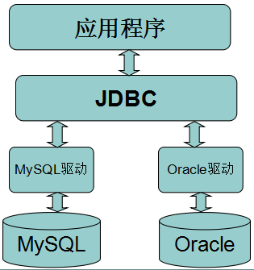
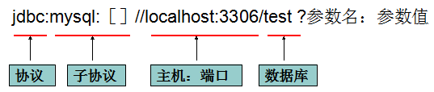

# JDBC
JDBC（Java Data Base Connectivity,java数据库连接）是一种用于执行SQL语句的Java API，可以为多种关系数据库提供统一访问，它由一组用Java语言编写的类和接口组成。

安装好数据库之后，应用程序也是不能直接使用数据库的，必须要通过相应的数据库驱动程序，通过驱动程序去和数据库打交道。其实也就是数据库厂商的JDBC接口实现，即对Connection等接口的实现类的jar文件。


## 一.常用接口

#### Driver接口
Driver接口由数据库厂家提供，作为java开发人员，只需要使用Driver接口就可以了。在编程中要连接数据库，必须先装载特定厂商的数据库驱动程序，不同的数据库有不同的装载方法。
```java
// 装载MySql驱动：
Class.forName("com.mysql.jdbc.Driver");

// 装载Oracle驱动：
Class.forName("oracle.jdbc.driver.OracleDriver");
```
#### Connection接口
Connection与特定数据库的连接（会话），在连接上下文中执行sql语句并返回结果。DriverManager.getConnection(url, user, password)方法建立在JDBC URL中定义的数据库Connection连接上。
```java
// 连接MySql数据库：
Connection conn = DriverManager.getConnection(
    "jdbc:mysql://host:port/database", "user", "password");

// 连接Oracle数据库：
Connection conn = DriverManager.getConnection(
    "jdbc:oracle:thin:@host:port:database", "user", "password");

// 连接SqlServer数据库：
Connection conn = DriverManager.getConnection(
    "jdbc:microsoft:sqlserver://host:port; DatabaseName=database", "user", "password");

// 常用方法：

createStatement()
// 创建向数据库发送sql的statement对象。
prepareStatement(sql)
// 创建向数据库发送预编译sql的PrepareSatement对象。
prepareCall(sql)
// 创建执行存储过程的callableStatement对象。
setAutoCommit(boolean autoCommit)
// 设置事务是否自动提交。
commit()
// 在链接上提交事务。
rollback()
// 在此链接上回滚事务。

```
#### Statement接口

用于执行静态SQL语句并返回它所生成结果的对象。
```java
// 三种Statement类：

Statement
// 由createStatement创建，用于发送简单的SQL语句（不带参数）。
PreparedStatement
// 继承自Statement接口，由preparedStatement创建，用于发送含有一个或多个参数的SQL语句。
// PreparedStatement对象比Statement对象的效率更高，并且可以防止SQL注入，所以我们一般都使用PreparedStatement。
CallableStatement
// 继承自PreparedStatement接口，由方法prepareCall创建，用于调用存储过程。

// 常用Statement方法：

execute(String sql)
// 运行语句，返回是否有结果集
executeQuery(String sql)
// 运行select语句，返回ResultSet结果集。
executeUpdate(String sql)
// 运行insert/update/delete操作，返回更新的行数。
addBatch(String sql)
// 把多条sql语句放到一个批处理中。
executeBatch()
// 向数据库发送一批sql语句执行。
```
#### ResultSet接口
ResultSet提供检索不同类型字段的方法，常用的有：
```java
getString(int index)
getString(String columnName)
// 获得在数据库里是varchar、char等类型的数据对象。

getFloat(int index)
getFloat(String columnName)
// 获得在数据库里是Float类型的数据对象。

getDate(int index)
getDate(String columnName)
// 获得在数据库里是Date类型的数据。

getBoolean(int index)
getBoolean(String columnName)
// 获得在数据库里是Boolean类型的数据。

getObject(int index)
getObject(String columnName)
// 获取在数据库里任意类型的数据。

// ResultSet还提供了对结果集进行滚动的方法：

next()
// 移动到下一行
Previous()
// 移动到前一行
absolute(int row)
// 移动到指定行
beforeFirst()
// 移动resultSet的最前面。
afterLast()
// 移动到resultSet的最后面。
```
使用后依次关闭对象及连接：ResultSet → Statement → Connection

## 二.使用JDBC的步骤
加载JDBC驱动程序 → 建立数据库连接Connection → 创建执行SQL的语句Statement → 处理执行结果ResultSet → 释放资源
#### 注册驱动 (只做一次)
```java
// 方式一
Class.forName("com.MySQL.jdbc.Driver")
// 推荐这种方式，不会对具体的驱动类产生依赖。

// 方式二
DriverManager.registerDriver(com.mysql.jdbc.Driver)
// 会造成DriverManager中产生两个一样的驱动，并会对具体的驱动类产生依赖。
```
URL用于标识数据库的位置，通过URL地址告诉JDBC程序连接哪个数据库，URL的写法为：

其他参数如：useUnicode=true&characterEncoding=utf8
#### 建立连接
```java
Connection conn = DriverManager.getConnection(url, user, password); 
```
#### 创建执行SQL语句的statement
```java
//Statement  
String id = "5";
String sql = "delete from table where id=" +  id;
Statement st = conn.createStatement();  
st.executeQuery(sql);  
//存在sql注入的危险
//如果用户传入的id为"5 or 1=1"，那么将删除表中的所有记录
```
```java
//PreparedStatement 有效的防止sql注入
// (SQL语句在程序运行前已经进行了预编译,当运行时动态地把参数传给PreprareStatement时，
// 即使参数里有敏感字符如 or '1=1'也数据库会作为一个参数一个字段的属性值来处理而不会作为一个SQL指令)
String sql = "insert into user (name,pwd) values(?,?)";  
PreparedStatement ps = conn.preparedStatement(sql);  
ps.setString(1, "col_value");  //占位符顺序从1开始
ps.setString(2, "123456"); //也可以使用setObject
ps.executeQuery();
```
#### 处理执行结果(ResultSet)
```java
ResultSet rs = ps.executeQuery();  
While(rs.next()){  
    rs.getString("col_name");  
    rs.getInt(1);  
    //…
}
```
#### 释放资源
```java
//数据库连接（Connection）非常耗资源，尽量晚创建，尽量早的释放
//都要加try catch 以防前面关闭出错，后面的就不执行了
try {
    if (rs != null) {
        rs.close();
    }
} catch (SQLException e) {
    e.printStackTrace();
} finally {
    try {
        if (st != null) {
            st.close();
        }
    } catch (SQLException e) {
        e.printStackTrace();
    } finally {
        try {
            if (conn != null) {
                conn.close();
            }
        } catch (SQLException e) {
            e.printStackTrace();
        }
    }
}
```
使用后依次关闭对象及连接：ResultSet → Statement → Connection

#### 实例

```java
// 批处理
package com.test.jdbc;

import java.sql.Connection;
import java.sql.DriverManager;
import java.sql.SQLException;
import java.sql.Statement;

/**
 * 测试ResultSet结果集的基本用法
 */
public class Demo05 {
    public static void main(String[] args) {
        Connection conn = null;
        Statement stmt = null;

        try {
            Class.forName("com.mysql.jdbc.Driver");
            conn = DriverManager.getConnection("jdbc:mysql://localhost:3306/testjdbc","root","mysql");

            conn.setAutoCommit(false); //设为手动提交

            long start = System.currentTimeMillis();

            stmt = conn.createStatement();
            for (int i = 0; i < 20000; i++) {
                stmt.addBatch("insert into t_user (userName,pwd,regTime) values ('hao" + i + "',666666,now())");
            }
            stmt.executeBatch();
            conn.commit();  //提交事务

            long end = System.currentTimeMillis();
            System.out.println("插入200000条数据，耗时(ms):" + (end - start));

        } catch (ClassNotFoundException e) {
            e.printStackTrace();
        } catch (SQLException e) {
            e.printStackTrace();
        } finally{

            try {
                if (stmt!=null) {
                    stmt.close();
                }
            } catch (SQLException e) {
                e.printStackTrace();
            }
            try {
                if (conn!=null) {
                    conn.close();
                }
            } catch (SQLException e) {
                e.printStackTrace();
            }
        }
    }
}

```
```java
// 测试事务的基本概念和用法
package com.test.jdbc;

import java.sql.Connection;
import java.sql.DriverManager;
import java.sql.PreparedStatement;
import java.sql.SQLException;

/**
 * 测试事务的基本概念和用法
 */
public class Demo06 {
    public static void main(String[] args) {
        Connection conn = null;
        PreparedStatement ps1 = null;
        PreparedStatement ps2 = null;

        try {
            Class.forName("com.mysql.jdbc.Driver");
            conn = DriverManager.getConnection("jdbc:mysql://localhost:3306/testjdbc","root","mysql");

            conn.setAutoCommit(false); //JDBC中默认是true，自动提交事务

            ps1 = conn.prepareStatement("insert into t_user(userName,pwd)values(?,?)"); //事务开始
            ps1.setObject(1, "小高");
            ps1.setObject(2, "123");
            ps1.execute();
            System.out.println("第一次插入");

            try {
                Thread.sleep(5000);
            } catch (InterruptedException e) {
                e.printStackTrace();
            }

            ps2 = conn.prepareStatement("insert into t_user(userName,pwd)values(?,?,?)");   //模拟执行失败(values的参数写成三个了)
            //insert时出现异常,执行conn.rollback
            ps2.setObject(1, "小张");
            ps2.setObject(2, "678");
            ps2.execute();
            System.out.println("第二次插入");    

            conn.commit();

        } catch (ClassNotFoundException e) {
            e.printStackTrace();
            try {
                conn.rollback();
            } catch (SQLException e1) {
                e1.printStackTrace();
            }
        } catch (SQLException e) {
            e.printStackTrace();
        } finally{

            try {
                if (ps1!=null) {
                    ps1.close();
                }
            } catch (SQLException e) {
                e.printStackTrace();
            }
            try {
                if (ps2!=null) {
                    ps2.close();
                }
            } catch (SQLException e) {
                e.printStackTrace();
            }
            try {
                if (conn!=null) {
                    conn.close();
                }
            } catch (SQLException e) {
                e.printStackTrace();
            }
        }
    }
}

// 测试事务的基本概念和用法
// 输出
// 第一次插入
// java.sql.SQLException: No value specified for parameter 3
//     at com.mysql.jdbc.SQLError.createSQLException(SQLError.java:1078)
//     at com.mysql.jdbc.SQLError.createSQLException(SQLError.java:989)
//     at com.mysql.jdbc.SQLError.createSQLException(SQLError.java:975)
//     at com.mysql.jdbc.SQLError.createSQLException(SQLError.java:920)
//     at com.mysql.jdbc.PreparedStatement.checkAllParametersSet(PreparedStatement.java:2611)
//     at com.mysql.jdbc.PreparedStatement.fillSendPacket(PreparedStatement.java:2586)
//     at com.mysql.jdbc.PreparedStatement.fillSendPacket(PreparedStatement.java:2510)
//     at com.mysql.jdbc.PreparedStatement.execute(PreparedStatement.java:1316)
//     at com.test.jdbc.Demo06.main(Demo06.java:39)
```


## 三.事务

#### 基本概念
一组要么同时执行成功，要么同时执行失败的SQL语句。是数据库操作的一个执行单元。
- 事务开始于
  - 连接到数据库上，并执行一条DML语句（INSERT、UPDATE、DELETE）
  - 前一个事务结束后，又输入了一条DML语句。
- 事务结束于
  - 执行Commit或Rollback语句 
  - 执行一条DDL语句，例如CREATE TABLE语句；在这种情况下，会自动执行COMMIT语句 
  - 执行一条DCL语句，例如GRANT语句，在这种情况下，会自动执行COMMIT语句 
  - 断开与数据库的连接 
  - 执行一条DML语句，该语句却失败了，在这种情况下，会为这个无效的DML语句执行ROLLBACK语句

#### 事务的四大特点
- 原子性(atomicity):表示一个事务内的所有操作都是一个整体，要么全部成功，要么全部失败
- 一致性(consistency):表示一个事务内有一个操作失败了，所有更改过的数据都必须会滚到修改前的状态
- 隔离性(isoation):事务查看数据时数据所处的状态，要么是另一并发事务修改它之前的状态，要么是另一事物修改它之后的状态，事务不会查看中间状态的数据。
- 持久性(durability):持久性事务完成之后，它对于系统的影响是永久性的。

#### 事务并发处理可能引起的问题
- 读脏(dirty read)：一个事务读取了另一个事务尚未提交的数据，
- 不可重复读(non-repeatable read)：一个事务的操作导致另一个事务前后两次读取到不同的数据
- 幻读(phantom read)：一个事务的操作导致另一个事务前后两次查询的结果数据量不同。

#### 事务隔离级别从低到高
4个等级的事务隔离级别，在相同的数据环境下，使用相同的输入，执行相同的工作，根据不同的隔离级别，可以导致不同的结果。不同事务隔离级别能够解决的数据并发问题的能力是不同的。
- `READ UNCOMMITTED`读取未提交:可能出现任何事物并发问题，什么都不处理。性能最好
- `READ COMMITTED`读取已提交`(Oracle)`:防止脏读，不能处理不可重复读和幻读,性能比`REPEATABLE READ`好
- `REPEATABLE READ`可重读`(MySQL)`:防止脏读和不可重复读，不能处理幻读,性能比`SERIALIZABLE`好
- `SERIALIZABLE`序列化(串行化):不会出现任何并发问题，因为它是对同一数据的访问是串行的，非并发访问的,性能最差

#### MySQL隔离级别
`MySQL`的默认隔离级别为Repeatable read,可以通过下面语句查看：
```sql
SELECT @@`TX_ISOLATION`;
```
也可以通过下面语句来设置当前连接的隔离级别：
```sql
SET TRANSACTION ISOLATION LEVEL REPEATABLE READ ;//[4选1]
```
JDBC设置隔离级别
```java
con.setTransactionIsolation(int level)

// 参数可选值如下：
Connection.TRANSACTION_READ_UNCOMMITTED
Connection.TRANSACTION_READ_COMMITTED
Connection.TRANSACTION_REPEATABLE_READ
Connection.TRANSACTION_READ_SERIALIZABLE
```
## 四.时间处理
java.util.Date
- 子类：java.sql.Date
- 子类：java.sql.Time
- 子类：java.sql.Timestamp
```java
// 存入时间
import java.sql.Timestamp;
import java.util.Random;
{
    ps = conn.prepareStatement("insert into t_user(userName,pwd,regTime,lastLoginTime)values(?,?,?,?)");
    ps.setObject(1, "小高" + i);
    ps.setObject(2, "123");

    //
    int random = 1000000000 + new Random().nextInt(1000000000); //随机时间

    java.sql.Date date = new java.sql.Date(System.currentTimeMillis() - random);    //插入随机时间
    java.sql.Timestamp stamp = new Timestamp(System.currentTimeMillis());   //如果需要插入指定时间，可以使用Calendar、DateFormat
    ps.setDate(3, date);
    ps.setTimestamp(4, stamp);
    
    ps.execute();
}
```
```java
// 读取时间
import java.text.DateFormat;
import java.text.ParseException;
import java.text.SimpleDateFormat;

{
    ps = conn.prepareStatement("select * from t_user where regTime > ? and regTime < ?");
    java.sql.Date start = new java.sql.Date(str2DateTime("2016-06-20 00:00:00"));
    java.sql.Date end = new java.sql.Date(str2DateTime("2016-06-24 00:00:00"));

    ps.setObject(1, start);
    ps.setObject(2, end);

    rs = ps.executeQuery();
    while(rs.next()){
    System.out.println(rs.getInt("id") + "--" + rs.getString("userName")+"--"+rs.getDate("regTime"));
    }
}
```
## 五.CLOB文本大对象操作
```java
import java.io.*;
import java.sql.*;
/*
 * CLOB(Character Large Object)
 * CLOB文本大对象操作
 *   用于存储大量的文本数据
 *      大字段有些特殊,不同数据库处理方式不一样,
 *      大字段的操做一般是以流的方式来处理,而非一般的字段,一次即可读取数据
 *  
 *  TINYTEXT,TINYBLOB
 *      一个BLOB或TEXT列，最大长度为255(2^8-1)个字符。
 *  BLOB,TEXT
 *      一个BLOB或TEXT列，最大长度为65535(2^16-1)个字符。
 *  MEDIUMBLOB,MEDIUMTEXT,
 *      一个BLOB或TEXT列，最大长度为16777215(2^24-1)个字符。
 *  LONGBLOB,LONGTEXT
 *      一个BLOB或TEXT列，最大长度为4294967295(2^32-1)个字符。
 */
public class TestCLOB {
    
    public static void main(String[] args) {
        Connection conn = null;
        PreparedStatement ps = null;
        ResultSet rs = null;
        Reader r = null;
        
        try {
            Class.forName("com.mysql.jdbc.Driver");
            conn = DriverManager.getConnection(
                    "jdbc:mysql://localhost:3306/test","root","123456");
            
            
            ps = conn.prepareStatement(
                    "insert into user (name,myInfo) values (?,?)");
            ps.setString(1, "张三");
            
            //将文本中的内容直接输入到数据库中
            ps.setClob(2, new FileReader(new File("E:/jar/1.txt")));
            ps.executeUpdate();
            
            /*
             *  //将程序中的字符串输入到数据库的CLOB字段中
               //1:从内到外,首先,将"aaabbb"字符串转换为字节流,然后转为输入流,将输入流转为字符流,就可以读取
             * ps.setClob(2, new BufferedReader(new InputStreamReader(
                    new ByteArrayInputStream("aaabbb".getBytes()))));
             */
            
            //读取写入的内容
            ps = conn.prepareStatement("select * from user where name=?");
            ps.setObject(1, 2);
            
            rs = ps.executeQuery();
            
            while(rs.next()){
                Clob c = rs.getClob("myInfo");
                r = c.getCharacterStream();
                int temp = 0;
                while((temp = r.read()) != -1){
                    System.out.println((char)temp);
                }
            }
        } catch (ClassNotFoundException e) {
            e.printStackTrace();
        } catch (Exception e) {
            e.printStackTrace();
        }finally{
            if(r != null){
                try {
                    r.close();
                } catch (IOException e) {
                    e.printStackTrace();
                }
            }
            
            if(rs != null){
                try {
                    rs.close();
                } catch (SQLException e) {
                    e.printStackTrace();
                }
            }
            
            if(ps != null){
                try {
                    ps.close();
                } catch (SQLException e) {
                    e.printStackTrace();
                }
            }
            
            if(conn != null){
                try {
                    conn.close();
                } catch (SQLException e) {
                    e.printStackTrace();
                }
            }
        }   
    }
}
```
## 六.BLOB二进制大对象的使用
```java
package com.test.jdbc;

import java.io.FileInputStream;
import java.io.FileOutputStream;
import java.io.InputStream;
import java.io.OutputStream;
import java.sql.Blob;
import java.sql.Connection;
import java.sql.DriverManager;
import java.sql.PreparedStatement;
import java.sql.ResultSet;
import java.sql.SQLException;

/**
 * 测试BLOB   二进制大对象的使用
 */
public class Demo10 {
    public static void main(String[] args) {
        Connection conn = null;
        PreparedStatement ps = null;
        PreparedStatement ps2 = null;
        ResultSet rs = null;
        InputStream is = null;
        OutputStream os = null;

        try {
            Class.forName("com.mysql.jdbc.Driver");
            conn = DriverManager.getConnection("jdbc:mysql://localhost:3306/testjdbc","root","mysql");

            //插入//
            ps = conn.prepareStatement("insert into t_user(userName,headImg)values(?,?)");
            ps.setString(1, "小高");
            ps.setBlob(2, new FileInputStream("G:/JAVA/test/d.jpg"));
            ps.execute();
            //

            //查询//
            ps2 = conn.prepareStatement("select * from t_user where id=?");
            ps2.setObject(1, 223024);

            rs = ps2.executeQuery();
            System.out.println("查询");
            while (rs.next()) {
                Blob b = rs.getBlob("headImg");
                is = b.getBinaryStream();
                os = new FileOutputStream("G:/JAVA/test/h.jpg");

                int temp = 0;
                while ((temp=is.read())!=-1) {
                    os.write(temp);
                }
            }

        } catch (ClassNotFoundException e) {
            e.printStackTrace();
        } catch (Exception e) {
            e.printStackTrace();
        } finally{

            try {
                if (os!=null) {
                    os.close();
                }
            } catch (Exception e) {
                e.printStackTrace();
            }
            try {
                if (is!=null) {
                    is.close();
                }
            } catch (Exception e) {
                e.printStackTrace();
            }
            try {
                if (rs!=null) {
                    rs.close();
                }
            } catch (SQLException e) {
                e.printStackTrace();
            }
            try {
                if (ps2!=null) {
                    ps2.close();
                }
            } catch (SQLException e) {
                e.printStackTrace();
            }
            try {
                if (ps!=null) {
                    ps.close();
                }
            } catch (SQLException e) {
                e.printStackTrace();
            }
            try {
                if (conn!=null) {
                    conn.close();
                }
            } catch (SQLException e) {
                e.printStackTrace();
            }
        }
    }
}
```
## 七.总结（简单封装、资源文件properties处理连接信息）
```shell
# db.properties
#右击该properties文件--properties--Resource--Text file encoding，选中other,选择其它编码方式。
#如UTF-8或GBK,这样就能在properties里面输入中文，而不会自动转成Unicode了。

#java中的properties文件是一种配置文件，主要用于表达配置信息。
#文件类型为*.properties，格式为文本文件，文件内容是"键=值"的格式。
#在properties文件中，可以用"#"来作注释

#MySQL连接配置
mysqlDriver=com.mysql.jdbc.Driver
mysqlURL=jdbc:mysql://localhost:3306/testjdbc
mysqlUser=root
mysqlPwd=mysql

#Oracle连接配置
#...

```
```java
// JDBCUtil工具类

package com.test.jdbc;

import java.io.IOException;
import java.sql.Connection;
import java.sql.DriverManager;
import java.sql.ResultSet;
import java.sql.SQLException;
import java.sql.Statement;
import java.util.Properties;

public class JDBCUtil {

    static Properties pros = null;  //可以帮助读取和处理资源文件中的信息

    static {    //加载JDBCUtil类的时候调用
        pros = new Properties();
        try {
            pros.load(Thread.currentThread().getContextClassLoader().getResourceAsStream("db.properties"));
        } catch (IOException e) {
            e.printStackTrace();
        }
    }

    public static Connection getMysqlConn(){
        try {
            Class.forName(pros.getProperty("mysqlDriver"));
            return DriverManager.getConnection(pros.getProperty("mysqlURL"),
                    pros.getProperty("mysqlUser"),pros.getProperty("mysqlPwd"));
        } catch (Exception e) {
            e.printStackTrace();
            return null;
        }
    }
    //可以重载多个，这里就懒得写了
    public static void close(ResultSet rs,Statement st,Connection conn){

        try {
            if (rs!=null) {
                rs.close();
            }
        } catch (SQLException e) {
            e.printStackTrace();
        }
        try {
            if (st!=null) {
                st.close();
            }
        } catch (SQLException e) {
            e.printStackTrace();
        }
        try {
            if (conn!=null) {
                conn.close();
            }
        } catch (SQLException e) {
            e.printStackTrace();
        }
    }
}

```
```java
// 测试使用JDBCUtil工具类来简化JDBC开发
package com.test.jdbc;

import java.sql.Connection;
import java.sql.PreparedStatement;
import java.sql.ResultSet;

/**
 * 测试使用JDBCUtil工具类来简化JDBC开发
 */
public class Demo11 {
    public static void main(String[] args) {
        Connection conn = null;
        PreparedStatement ps = null;
        ResultSet rs = null;

        try {
            conn = JDBCUtil.getMysqlConn();

            ps = conn.prepareStatement("insert into t_user (userName) values (?)");
            ps.setString(1, "小高高");
            ps.execute();

        } catch (Exception e) {
            e.printStackTrace();
        } finally{
            JDBCUtil.close(rs, ps, conn);
        }
    }
}

```


[参考链接](https://www.cnblogs.com/erbing/p/5805727.html)
[参考链接](https://www.jianshu.com/p/577e3dcd932c)