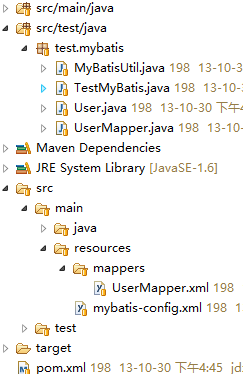

# MyBatis使用示例

项目结构


### POM依赖
`pom.xml`文件
```xml
<dependency>
    <groupId>org.mybatis</groupId>
    <artifactId>mybatis</artifactId>
    <version>3.2.3</version>
</dependency>
<dependency>
    <groupId>mysql</groupId>
    <artifactId>mysql-connector-java</artifactId>
    <version>5.1.26</version>
</dependency>
```
### 生成测试数据
`SQL语句`
```sql
CREATE DATABASE mybatis_test;

CREATE TABLE user
(
    age INTEGER NOT NULL,
    name VARCHAR(64) NOT NULL DEFAULT ''

);

insert user values(18,'zhanjindong');
insert user values(20,'zhangsan');
```
### 配置文件
MyBatis的配置文件

`mybatis-config.xml`
```xml
<?xml version="1.0" encoding="UTF-8"?>   
<!DOCTYPE configuration   
    PUBLIC "-//mybatis.org//DTD Config 3.0//EN"   
    "http://mybatis.org/dtd/mybatis-3-config.dtd">   
    
<configuration>   
    <settings>   
        <!-- changes from the defaults for testing -->   
        <setting name="cacheEnabled" value="false" />   
        <setting name="useGeneratedKeys" value="true" />   
        <setting name="defaultExecutorType" value="REUSE" />   
    </settings>   
    <typeAliases>   
       <typeAlias alias="User" type="test.mybatis.User"/>   
    </typeAliases>   
    <environments default="development">   
       <environment id="development">   
           <transactionManager type="jdbc"/>   
           <dataSource type="POOLED">   
              <property name="driver" value="com.mysql.jdbc.Driver"/>   
              <property name="url" value="jdbc:mysql://192.168.71.38:3306/mybatis_test"/>   
              <property name="username" value="root"/>   
              <property name="password" value="123456"/>   
           </dataSource>   
       </environment>   
    </environments>   
    <mappers>   
        <mapper resource="mappers/UserMapper.xml" />   
    </mappers>   
</configuration>  
```
数据访问接口映射文件

`UserMapper.xml`
```xml
<?xml version="1.0" encoding="UTF-8" ?>   
<!DOCTYPE mapper   
    PUBLIC "-//mybatis.org//DTD Mapper 3.0//EN"   
    "http://mybatis.org/dtd/mybatis-3-mapper.dtd">
<mapper namespace="test.mybatis.UserMapper">
    <!-- 这里namespace必须是UserMapper接口的路径” -->
    <insert id="insertUser" parameterType="User">
        insert into user(name,age) values(#{name},#{age})
        <!-- 这里sql结尾不能加分号，否则报“ORA-00911”的错误 -->
    </insert>

    <!-- 这里的id必须和UserMapper接口中的接口方法名相同 -->
    <select id="getUser" resultType="User" parameterType="java.lang.String">
        select * from user where name=#{name}
    </select>
</mapper> 
```
### 接口文件
访问数据表的接口

`UserMapper.java`
```java
package test.mybatis;

public interface UserMapper {
    public void insertUser(User user);

    public User getUser(String name);
}
```
### 对象
一个POJO(简单普通的java对象，我理解为数据模型类)

`User.java`
```java
package test.mybatis;

public class User {
    private String name;
    private Integer age;

    public String getName() {
        return name;
    }

    public void setName(String name) {
        this.name = name;
    }

    public Integer getAge() {
        return age;
    }

    public void setAge(Integer age) {
        this.age = age;
    }

    public User(String name, Integer age) {
        super();
        // 调用父类具有相同形参的构造方法
        this.name = name;
        this.age = age;
    }

    public User() {
        super();
        // 调用父类具有相同形参的构造方法
        // super()只能在构造函数的第一行使用，在别的地方使用均为非法，
        // 一般情况下构造函数不用写super()，但是如果一个类有多个构造函数的时候，
        // 为了便于理解，往往要显式调用super()。
    }
}
```

### 测试
工具类文件

`MyBatisUtil.java`
```java
package test.mybatis;

import java.io.IOException;
import java.io.Reader;

import org.apache.ibatis.io.Resources;
import org.apache.ibatis.session.SqlSessionFactory;
import org.apache.ibatis.session.SqlSessionFactoryBuilder;

public class MyBatisUtil {
    private final static SqlSessionFactory sqlSessionFactory;
    static {
        String resource = "mybatis-config.xml";
        Reader reader = null;
        try {
            reader = Resources.getResourceAsReader(resource);
        } catch (IOException e) {
            System.out.println(e.getMessage());

        }
        sqlSessionFactory = new SqlSessionFactoryBuilder().build(reader);
    }

    public static SqlSessionFactory getSqlSessionFactory() {
        return sqlSessionFactory;
    }
}
```

测试类

`TestMyBatis.java`
```java
package test.mybatis;

import org.apache.ibatis.session.SqlSession;
import org.apache.ibatis.session.SqlSessionFactory;

public class TestMyBatis {
    static SqlSessionFactory sqlSessionFactory = null;
    static {
        sqlSessionFactory = MyBatisUtil.getSqlSessionFactory();
    }

    public static void main(String[] args) {
        testAdd();
        getUser();
    }

    public static void testAdd() {
        SqlSession sqlSession = sqlSessionFactory.openSession();
        try {
            UserMapper userMapper = sqlSession.getMapper(UserMapper.class);
            User user = new User("lisi", new Integer(25));
            userMapper.insertUser(user);
            sqlSession.commit();
            // 这里一定要提交，不然数据不会写入数据库中
        } finally {
            sqlSession.close();
            // 在finally确保会话关闭
        }
    }

    public static void getUser() {
        SqlSession sqlSession = sqlSessionFactory.openSession();
        try {
            UserMapper userMapper = sqlSession.getMapper(UserMapper.class);
            User user = userMapper.getUser("zhangsan");
            System.out.println("name: " + user.getName() + "|age: "
                    + user.getAge());
        } finally {
            sqlSession.close();
        }
    }
}
```


[原文地址](https://www.cnblogs.com/zhanjindong/p/3397828.html)