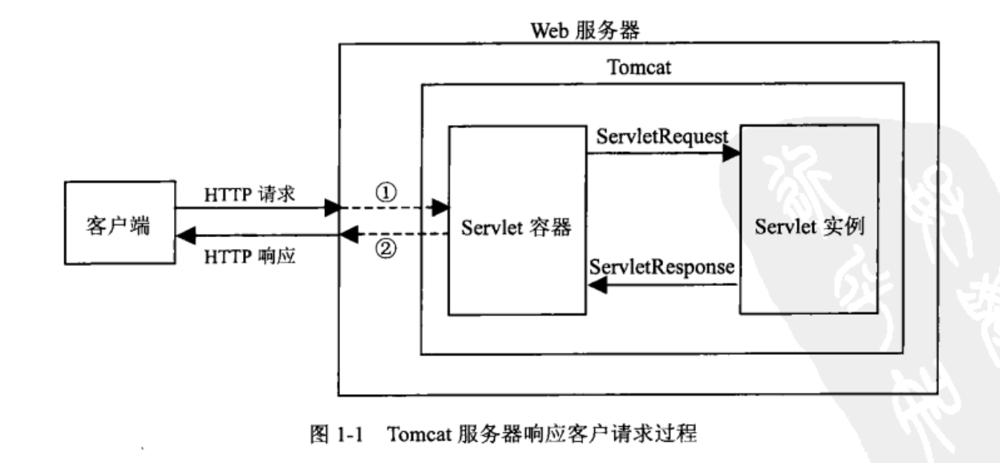

# servlet 
Servlet是为了解决实现动态页面而衍生的东西

tomcat和servlet的关系:Tomcat 是Web应用服务器,是一个Servlet/JSP容器。Tomcat 作为Servlet容器,负责处理客户请求,把请求传送给Servlet,并将Servlet的响应传送回给客户.而Servlet是一种运行在支持Java语言的服务器上的组件. Servlet最常见的用途是扩展Java Web服务器功能,提供非常安全的,可移植的,易于使用的CGI替代品.

1. Tomcat将http请求文本接收并解析，然后封装成HttpServletRequest类型的request对象，所有的HTTP头数据读可以通过request对象调用对应的方法查询到。
1. Tomcat同时会将要响应的信息封装为HttpServletResponse类型的response对象，通过设置response属性就可以控制要输出到浏览器的内容，然后将response交给tomcat，tomcat就会将其变成响应文本的格式发送给浏览器

## servlet方法
init() 方法
```java
// init() 方法简单地创建或加载一些数据，这些数据将被用于 Servlet 的整个生命周期。
public void init() throws ServletException {
  // 初始化代码...
}
```
service() 方法
```java
// 每次服务器接收到一个 Servlet 请求时，服务器会产生一个新的线程并调用服务。
// service() 方法检查 HTTP 请求类型（GET、POST、PUT、DELETE 等），
// 并在适当的时候调用 doGet、doPost、doPut，doDelete 等方法。
public void service(ServletRequest request, 
                    ServletResponse response) 
      throws ServletException, IOException{
}
```
>service() 方法由容器调用，service 方法在适当的时候调用 doGet、doPost、doPut、doDelete 等方法。所以，您不用对 service() 方法做任何动作，您只需要根据来自客户端的请求类型来重写 doGet() 或 doPost() 即可。
doGet() 方法
```java
// GET 请求来自于一个 URL 的正常请求，或者来自于一个未指定 METHOD 的 HTML 表单，它由 doGet() 方法处理。
public void doGet(HttpServletRequest request,
                  HttpServletResponse response)
    throws ServletException, IOException {
    // Servlet 代码
}
```
doPost() 方法
```java
// POST 请求来自于一个特别指定了 METHOD 为 POST 的 HTML 表单，它由 doPost() 方法处理。
public void doPost(HttpServletRequest request,
                   HttpServletResponse response)
    throws ServletException, IOException {
    // Servlet 代码
}
```
destroy() 方法
```java
// destroy() 方法只会被调用一次，在 Servlet 生命周期结束时被调用。
// destroy() 方法可以让您的 Servlet 关闭数据库连接、停止后台线程、
// 把 Cookie 列表或点击计数器写入到磁盘，并执行其他类似的清理活动。
// 在调用 destroy() 方法之后，servlet 对象被标记为垃圾回收。
public void destroy() {
// 终止化代码...
}
```
## 实例
java和javax都是Java的API(Application Programming Interface)包，java是核心包， javax的x是extension的意思，也就是扩展包。
```java
// HelloWorld.java
// 导入必需的 java 库
import java.io.*;
import javax.servlet.*;
import javax.servlet.http.*;

// 扩展 HttpServlet 类
public class HelloWorld extends HttpServlet {
 
  private String message;

  public void init() throws ServletException
  {
      // 执行必需的初始化
      message = "Hello World";
  }

  public void doGet(HttpServletRequest request,
                    HttpServletResponse response)
            throws ServletException, IOException
  {
      // 设置响应内容类型
      response.setContentType("text/html");

      // 实际的逻辑是在这里
      PrintWriter out = response.getWriter();
      out.println("<h1>" + message + "</h1>");
  }
  
  public void destroy()
  {
      // 什么也不做
  }
}
```
编译 Servlet
```shell
# C:\ServletDevel或 /usr/ServletDevel
javac HelloWorld.java
# 如果 Servlet 依赖于任何其他库，必须在 CLASSPATH 中包含那些 JAR 文件
```
Servlet 部署
```shell
# Servlet 应用程序默认路径
# <Tomcat-installation-directory>/webapps/ROOT
# 类文件路径
# <Tomcat-installation-directory>/webapps/ROOT/WEB-INF/classes
# 类名称 com.myorg.MyServlet必须位于 WEB-INF/classes/com/myorg/MyServlet.class 中
# 把 HelloWorld.class 复制到 
# <Tomcat-installation-directory>/webapps/ROOT/WEB-INF/classes 中

# <Tomcat-installation-directory>/webapps/ROOT/WEB-INF/web.xml
# 文件中创建以下条目
```
```xml
<web-app>      
    <servlet>
        <servlet-name>HelloWorld</servlet-name>
        <servlet-class>HelloWorld</servlet-class>
    </servlet>

    <servlet-mapping>
        <servlet-name>HelloWorld</servlet-name>
        <url-pattern>/HelloWorld</url-pattern>
    </servlet-mapping>
</web-app>
```
```shell
# 启动 tomcat 服务器
# <Tomcat-installation-directory>\bin\startup.bat或 
# <Tomcat-installation-directory>/bin/startup.sh
# 在浏览器的地址栏中输入 http://localhost:8080/HelloWorld
# 如果一切顺利，会看到下面的结果
```


## Servlet 表单数据
### GET 方法
GET 方法是默认的从浏览器向 Web 服务器传递信息的方法，它会产生一个很长的字符串，出现在浏览器的地址栏中。如果您要向服务器传递的是密码或其他的敏感信息，请不要使用 GET 方法。GET 方法有大小限制：请求字符串中最多只能有 1024 个字符。
- getParameter()：您可以调用 request.getParameter() 方法来获取表单参数的值。
- getParameterValues()：如果参数出现一次以上，则调用该方法，并返回多个值，例如复选框。
- getParameterNames()：如果您想要得到当前请求中的所有参数的完整列表，则调用该方法。

```java
// 处理http://localhost:8080/TomcatTest/HelloForm?name=菜鸟教程&url=www.runoob.com
package com.runoob.test;

import java.io.IOException;
import java.io.PrintWriter;

import javax.servlet.ServletException;
import javax.servlet.annotation.WebServlet;
import javax.servlet.http.HttpServlet;
import javax.servlet.http.HttpServletRequest;
import javax.servlet.http.HttpServletResponse;

/**
 * Servlet implementation class HelloForm
 */
@WebServlet("/HelloForm")
public class HelloForm extends HttpServlet {
    private static final long serialVersionUID = 1L;
       
    /**
     * @see HttpServlet#HttpServlet()
     */
    public HelloForm() {
        super();
        // TODO Auto-generated constructor stub
    }

    /**
     * @see HttpServlet#doGet(HttpServletRequest request, HttpServletResponse response)
     */
    protected void doGet(HttpServletRequest request, HttpServletResponse response) throws ServletException, IOException {
        // 设置响应内容类型
        response.setContentType("text/html;charset=UTF-8");

        PrintWriter out = response.getWriter();
        String title = "使用 GET 方法读取表单数据";
        // 处理中文
        String name =new String(request.getParameter("name").getBytes("ISO8859-1"),"UTF-8");
        String docType = "<!DOCTYPE html> \n";
        out.println(docType +
            "<html>\n" +
            "<head><title>" + title + "</title></head>\n" +
            "<body bgcolor=\"#f0f0f0\">\n" +
            "<h1 align=\"center\">" + title + "</h1>\n" +
            "<ul>\n" +
            "  <li><b>站点名</b>："
            + name + "\n" +
            "  <li><b>网址</b>："
            + request.getParameter("url") + "\n" +
            "</ul>\n" +
            "</body></html>");
    }
    
    // 处理 POST 方法请求的方法
    public void doPost(HttpServletRequest request, HttpServletResponse response) throws ServletException, IOException {
        doGet(request, response);
    }
}
```
web.xml 文件
```xml
<?xml version="1.0" encoding="UTF-8"?>
<web-app>
  <servlet>
    <servlet-name>HelloForm</servlet-name>
    <servlet-class>com.runoob.test.HelloForm</servlet-class>
  </servlet>
  <servlet-mapping>
    <servlet-name>HelloForm</servlet-name>
    <url-pattern>/TomcatTest/HelloForm</url-pattern>
  </servlet-mapping>
</web-app>
```
html文件
```html
<!DOCTYPE html>
<html>
<head>
<meta charset="utf-8">
<title>菜鸟教程(runoob.com)</title>
</head>
<body>
<form action="HelloForm" method="GET">
网址名：<input type="text" name="name">
<br />
网址：<input type="text" name="url" />
<input type="submit" value="提交" />
</form>
</body>
</html>
```

### POST 方法
另一个向后台程序传递信息的比较可靠的方法是 POST 方法。POST 方法打包信息的方式与 GET 方法基本相同，但是 POST 方法不是把信息作为 URL 中 ? 字符后的文本字符串进行发送，而是把这些信息作为一个单独的消息。

>如果表单提交的数据中有中文数据则需要转码
```java
String name =new String(request.getParameter("name").getBytes("ISO8859-1"),"UTF-8");
```
```java
package com.runoob.test;

import java.io.IOException;
import java.io.PrintWriter;

import javax.servlet.ServletException;
import javax.servlet.annotation.WebServlet;
import javax.servlet.http.HttpServlet;
import javax.servlet.http.HttpServletRequest;
import javax.servlet.http.HttpServletResponse;

/**
 * Servlet implementation class HelloForm
 */
@WebServlet("/HelloForm")
public class HelloForm extends HttpServlet {
    private static final long serialVersionUID = 1L;
       
    /**
     * @see HttpServlet#HttpServlet()
     */
    public HelloForm() {
        super();
        // TODO Auto-generated constructor stub
    }

    /**
     * @see HttpServlet#doGet(HttpServletRequest request, HttpServletResponse response)
     */
    protected void doGet(HttpServletRequest request, HttpServletResponse response) throws ServletException, IOException {
        // 设置响应内容类型
        response.setContentType("text/html;charset=UTF-8");

        PrintWriter out = response.getWriter();
        String title = "使用 POST 方法读取表单数据";
        // 处理中文
        String name =new String(request.getParameter("name").getBytes("ISO8859-1"),"UTF-8");
        String docType = "<!DOCTYPE html> \n";
        out.println(docType +
            "<html>\n" +
            "<head><title>" + title + "</title></head>\n" +
            "<body bgcolor=\"#f0f0f0\">\n" +
            "<h1 align=\"center\">" + title + "</h1>\n" +
            "<ul>\n" +
            "  <li><b>站点名</b>："
            + name + "\n" +
            "  <li><b>网址</b>："
            + request.getParameter("url") + "\n" +
            "</ul>\n" +
            "</body></html>");
    }
    
    // 处理 POST 方法请求的方法
    public void doPost(HttpServletRequest request, HttpServletResponse response) throws ServletException, IOException {
        doGet(request, response);
    }
}
```
html文件
```html
<!DOCTYPE html>
<html>
<head>
<meta charset="utf-8">
<title>菜鸟教程(runoob.com)</title>
</head>
<body>
<form action="HelloForm" method="POST">
网址名：<input type="text" name="name">
<br />
网址：<input type="text" name="url" />
<input type="submit" value="提交" />
</form>
</body>
</html>
```
### 复选框
html
```html
<form action="CheckBox" method="POST" target="_blank">
<input type="checkbox" name="runoob" checked="checked" /> 菜鸟教程
<input type="checkbox" name="google"  /> Google
<input type="checkbox" name="taobao" checked="checked" /> 淘宝
<input type="submit" value="选择站点" />
</form>
```
```java
request.getParameter("runoob");
request.getParameter("google");
request.getParameter("taobao");
```
### 读取所有的表单参数
- getParameterNames() 方法读取所有可用的表单参数。该方法返回一个枚举，其中包含未指定顺序的参数名。
- hasMoreElements() 方法来确定何时停止
- nextElement() 方法来获取每个参数的名称
```java
Enumeration paramNames = request.getParameterNames();

while(paramNames.hasMoreElements()) {
    String paramName = (String)paramNames.nextElement();
    out.print("<tr><td>" + paramName + "</td>\n");
    String[] paramValues =
    request.getParameterValues(paramName);
    // 读取单个值的数据
    if (paramValues.length == 1) {
        String paramValue = paramValues[0];
        if (paramValue.length() == 0)
            out.println("<td><i>没有值</i></td>");
        else
            out.println("<td>" + paramValue + "</td>");
    } else {
        // 读取多个值的数据
        out.println("<td><ul>");
        for(int i=0; i < paramValues.length; i++) {
        out.println("<li>" + paramValues[i]);
    }
        out.println("</ul></td>");
    }
    out.print("</tr>");
}
out.println("\n</table>\n</body></html>");
```
[参考链接](https://www.runoob.com/servlet/servlet-life-cycle.html)
[参考链接](https://www.cnblogs.com/whgk/p/6399262.html)