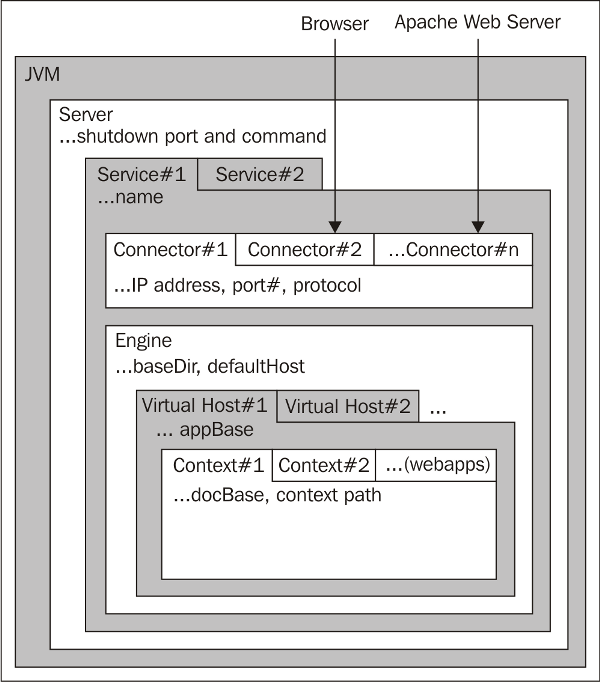

# tomcat
Tomcat 服务器是一个免费的开放源代码的Web 应用服务器,是一个servlet容器。尽管Tomcat对Jave EE API的实现并不完整，然而很企业也在渐渐抛弃使用传统的Java EE技术（如EJB）转而采用一些开源组件来构建复杂的应用。这些开源组件如Structs、Spring和Hibernate，而Tomcat能够对这些组件实现完美的支持。

## 架构

1. 服务器(server)：Tomcat的一个实例，通常一个JVM只能包含一个Tomcat实例；因此，一台物理服务器上可以在启动多个JVM的情况下在每一个JVM中启动一个Tomcat实例，每个实例分属于一个独立的管理端口。这是一个顶级组件。
1. 服务(service)：一个服务组件通常包含一个引擎和与此引擎相关联的一个或多个连接器。给服务命名可以方便管理员在日志文件中识别不同服务产生的日志。一个server可以包含多个service组件，但通常情下只为一个service指派一个server。
1. 连接器(connectors)：负责连接客户端（可以是浏览器或Web服务器）请求至Servlet容器内的Web应用程序，通常指的是接收客户发来请求的位置及服务器端分配的端口。默认端口通常是HTTP协议的8080，管理员也可以根据自己的需要改变此端口。一个引擎可以配置多个连接器，但这些连接器必须使用不同的端口。默认的连接器是基于HTTP/1.1的Coyote。同时，Tomcat也支持AJP、JServ和JK2连接器。
1. 引擎(Engine)：引擎通常是指处理请求的Servlet引擎组件，即Catalina Servlet引擎，它检查每一个请求的HTTP首部信息以辨别此请求应该发往哪个host或context，并将请求处理后的结果返回的相应的客户端。严格意义上来说，容器不必非得通过引擎来实现，它也可以是只是一个容器。如果Tomcat被配置成为独立服务器，默认引擎就是已经定义好的引擎。而如果Tomcat被配置为Apache Web服务器的提供Servlet功能的后端，默认引擎将被忽略，因为Web服务器自身就能确定将用户请求发往何处。一个引擎可以包含多个host组件。
1. 主机(Host)：主机组件类似于Apache中的虚拟主机，但在Tomcat中只支持基于FQDN的“虚拟主机”。一个引擎至少要包含一个主机组件。
1. 上下文(Context)：Context组件是最内层次的组件，它表示Web应用程序本身。配置一个Context最主要的是指定Web应用程序的根目录，以便Servlet容器能够将用户请求发往正确的位置。Context组件也可包含自定义的错误页，以实现在用户访问发生错误时提供友好的提示信息。
1. 阀门(Valve)：用来拦截请求并在将其转至目标之前进行某种处理操作，类似于Servlet规范中定义的过滤器。Valve可以定义在任何容器类的组件中。Valve常被用来记录客户端请求、客户端IP地址和服务器等信息，这种处理技术通常被称作请求转储(request dumping)。请求转储valve记录请求客户端请求数据包中的HTTP首部信息和cookie信息文件中，响应转储valve则记录响应数据包首部信息和cookie信息至文件中。
1. 日志记录器(Logger)：用于记录组件内部的状态信息，可被用于除Context之外的任何容器中。日志记录的功能可被继承，因此，一个引擎级别的Logger将会记录引擎内部所有组件相关的信息，除非某内部组件定义了自己的Logger组件。
1. 领域(Realm)：用于用户的认证和授权；在配置一个应用程序时，管理员可以为每个资源或资源组定义角色及权限，而这些访问控制功能的生效需要通过Realm来实现。Realm的认证可以基于文本文件、数据库表、LDAP服务等来实现。Realm的效用会遍及整个引擎或顶级容器，因此，一个容器内的所有应用程序将共享用户资源。同时，Realm可以被其所在组件的子组件继承，也可以被子组件中定义的Realm所覆盖。


## JDK和Tomcat安装
[tomcat下载](https://tomcat.apache.org/)
[jdk下载](https://www.oracle.com/technetwork/java/javase/downloads/index.html)
版本要求
Tomcat|jdk
--|--
9.0.0.M17 (alpha)|8 and later
8.5.11|7 and later
8.0.41 (superseded)|7 and later
7.0.75|6 and later(7 and later for WebSocket)

- JDK安装
```shell
# 为了方便维护下载到/usr/local/java目录并解压
tar -zxvf jdk-8u91-linux-x64.tar.gz                      
# 解压后JDK目录为：/usr/local/java/jdk1.8.0_91
# 设置环境变量（根据具体版本修改配置）：
# 编辑/etc/profile文件在最末尾加入以下内容：
export JAVA_HOME=/usr/local/java/jdk1.8.0_91
export JRE_HOME=/usr/local/java/jdk1.8.0_91/jre
export CLASSPATH=.:$JAVA_HOME/lib/dt.jar:$JAVA_HOME/lib/tools.jar:$JRE_HOME/lib:$CLASSPATH
export PATH=$PATH:$JAVA_HOME/bin

# 执行source /etc/profile使环境变量配置生效
# 执行java –version可以看到当前的JDK版本
```
- Tomcat安装
```shell
# 下载到home目录，解压
# 为了后续的权限控制，添加tomcat组和用户并设置tomcat目录为tomcat用户所属：
groupadd tomcat
useradd -g tomcat -s /sbin/nologin tomcat
chown -R tomcat:tomcat /home/apache-tomcat-8.5.3
# 启动tomcat: 直接使用tomcat目录下bin目录中startup.sh进行启动。
# 停止tomcat: 直接使用tomcat目录下bin目录中shutdown.sh进行停止。

# 开机自启动
# 在/etc/rc.local文件中添加对应启动命令，
# 如：/home/apache-tomcat-8.5.3/bin/startup.sh      
# 或注册为服务启动：
# 在/etc/init.d/目录新建一个tomcat文件并写入下面内容(这里安装的tomcat8所以设置文件名为tomcat8)：
```
```shell
#!/bin/bash
# tomcat8
# chkconfig: - 80 20
### BEGIN INIT INFO
# Provides: tomcat8
# Required-Start: $network $syslog
# Required-Stop: $network $syslog
# Default-Start:
# Default-Stop:
# Description: Tomcat 8
# Short-Description: start and stop tomcat
### END INIT INFO

## Source function library.
#. /etc/rc.d/init.d/functions
export JAVA_OPTS="-Dfile.encoding=UTF-8 \
  -Dnet.sf.ehcache.skipUpdateCheck=true \
  -XX:+UseConcMarkSweepGC \
  -XX:+CMSClassUnloadingEnabled \
  -XX:+UseParNewGC \
  -XX:MaxPermSize=128m \
  -Xms512m -Xmx512m"
TOMCAT_HOME=/opt/tomcat8
TOMCAT_USER=tomcat
SHUTDOWN_WAIT=20

tomcat_pid() {
  echo `ps aux | grep org.apache.catalina.startup.Bootstrap | grep -v grep | awk '{ print $2 }'`
}

start() {
  pid=$(tomcat_pid)
  if [ -n "$pid" ] 
  then
    echo "Tomcat is already running (pid: $pid)"
  else
    # Start tomcat
    echo "Starting tomcat"
    ulimit -n 100000
    umask 007
    /bin/su -p -s /bin/sh $TOMCAT_USER $TOMCAT_HOME/bin/startup.sh
  fi


  return 0
}

stop() {
  pid=$(tomcat_pid)
  if [ -n "$pid" ]
  then
    echo "Stoping Tomcat"
    /bin/su -p -s /bin/sh $TOMCAT_USER $TOMCAT_HOME/bin/shutdown.sh

    let kwait=$SHUTDOWN_WAIT
    count=0;
    until [ `ps -p $pid | grep -c $pid` = '0' ] || [ $count -gt $kwait ]
    do
      echo -n -e "\nwaiting for processes to exit";
      sleep 1
      let count=$count+1;
    done

    if [ $count -gt $kwait ]; then
      echo -n -e "\nkilling processes which didn't stop after $SHUTDOWN_WAIT seconds"
      kill -9 $pid
    fi
  else
    echo "Tomcat is not running"
  fi
 
  return 0
}

case $1 in
start)
  start
;; 
stop)   
  stop
;; 
restart)
  stop
  start
;;
status)
  pid=$(tomcat_pid)
  if [ -n "$pid" ]
  then
    echo "Tomcat is running with pid: $pid"
  else
    echo "Tomcat is not running"
  fi
;; 
esac    
exit 0

```
```shell
# 赋予该文件执行权限：
chmod +x /etc/init.d/tomcat8 
# 添加自动启动：
chkconfig tomcat8 on
```
## Tomcat配置
Tomcat的配置文件默认存放在`/home/apache-tomcat-8.5.3/conf/`目录中，主要有以下几个
- server.xml: Tomcat的主配置文件，包含Service, Connector, Engine, Realm, Valve, Hosts主组件的相关配置信息；
- web.xml：遵循Servlet规范标准的配置文件，用于配置servlet，并为所有的Web应用程序提供包括MIME映射等默认配置信息；
- tomcat-user.xml：Realm认证时用到的相关角色、用户和密码等信息；Tomcat自带的manager默认情况下会用到此文件；在Tomcat中添加/删除用户，为用户指定角色等将通过编辑此文件实现；
- catalina.policy：Java相关的安全策略配置文件，在系统资源级别上提供访问控制的能力；
- catalina.properties：Tomcat内部package的定义及访问相关的控制，也包括对通过类装载器装载的内容的控制；Tomcat6在启动时会事先读取此文件的相关设置；
- logging.properties: Tomcat6通过自己内部实现的JAVA日志记录器来记录操作相关的日志，此文件即为日志记录器相关的配置信息，可以用来定义日志记录的组件级别以及日志文件的存在位置等；
- context.xml：所有host的默认配置信息；

### 相同端口多站点配置
找到Host字段并在`</host>`下面新增即可host配置字段：
```xml
<Host name="wwww.abc.com" appBase="/wwwroot/abc/"
unpackWARs="true" autoDeploy="true">
<Context path="" docBase="/wwwroot/abc/" reloadable="true" deubg="0" />
<Valve className="org.apache.catalina.valves.AccessLogValve" directory="logs"
prefix="antisec_access_log" suffix=".txt"
pattern="%h %l %u %t &quot;%r&quot; %s %b" />
<Alias>www.域名1.com</Alias>
<Alias>www.域名2.com</Alias>
<Alias>www.域名3.com</Alias>
</Host>
```
把name、appBase、docBase的内容改为实际的域名和项目路径。

`<Alias>xxx</Alias>`为绑定多个域名，如果不需要在绑定其他域名则不用配置。
### 不同端口多站点配置
在默认`</Service>`后面新增以下内容：
```xml
<!--services1-start-->
<Service name="Catalina">
<Connector port="8080" protocol="HTTP/1.1"
connectionTimeout="20000" redirectPort="8443" />
<!-- Define an AJP 1.3 Connector on port 8009 -->
<Connector port="8009" protocol="AJP/1.3" redirectPort="8443" />

<Engine name="Catalina" defaultHost="www.abc.com">
<Realm className="org.apache.catalina.realm.LockOutRealm">
<Realm className="org.apache.catalina.realm.UserDatabaseRealm" resourceName="UserDatabase"/>
</Realm>
  
<Host name="www.abc.cn" appBase="/wwwroot/abc/"
unpackWARs="true" autoDeploy="true">
<Context path="" docBase="D:\wwwroot\tomcat" reloadable="true" deubg="0" />
<Valve className="org.apache.catalina.valves.AccessLogValve" directory="logs"
prefix="antisec_access_log" suffix=".txt"
pattern="%h %l %u %t &quot;%r&quot; %s %b" />
</Host>
</Engine>
</Service>
<!--services1-end-->
```
其中Connector port、defaultHost、Hostname、appBase、docBase、日志prefix为你实际的即可。

### 多tomcat运行
- 第一个tomcat文件夹为tomcat8-1，路径为/home/tomcat8-1/         
- 第二个tomcat文件夹为tomcat8-2，路径为/home/tomcat8-2/      
- 分别修改tomcat文件夹/conf目录下server.xml的监听端口为不同端口。
- 分别启动tomcat文件夹/bin目录下的startup.sh启动tomcat，停止同上文。
即可运行多个tomcat。

### Tomcat绑定SSL证书
根据官方文档tomcat8.5且JAVA7及其以上才支持SNI。如果tomcat版本较低且需要绑定多个域名情况下，建议使用反向代理方式部署HTTPS。
```xml
<Connector port="443"
protocol="HTTP/1.1"
SSLEnabled="true"
scheme="https"
secure="true"
keystoreFile="pfx证书路径"
keystoreType="PKCS12"
keystorePass="证书导入密码"
clientAuth="false"
ciphers="TLS_ECDHE_RSA_WITH_AES_128_GCM_SHA256"
SSLProtocol="TLSv1+TLSv1.1+TLSv1.2"
SSLCipherSuite="ECDHE-RSA-AES128-GCM-SHA256:ECDHE:ECDH:AES:HIGH:!NULL:!aNULL:!MD5:!ADH:!RC4"/>
```
保存后重启tomcat服务

### 多域名SSL绑定
```xml
<Connector port="443"
    protocol="org.apache.coyote.http11.Http11Nio2Protocol"
    maxThreads="150"
    SSLEnabled="true"
    defaultSSLHostConfigName="milworm.cn" >
    <!--第一个域名证书设置-->
    <SSLHostConfig hostName="milworm.cn" >
    <Certificate certificateKeyFile="D:/server/Apache2.2/conf/cert/milwrom/private.key"
        certificateFile="D:/server/Apache2.2/conf/cert/milwrom/certificate.crt"
        certificateChainFile="D:/server/Apache2.2/conf/cert/milwrom/ca_bundle.crt"
        type="RSA" />
    </SSLHostConfig>    
    <!--第二个域名证书设置--> 
    <SSLHostConfig hostName="www.pentester.cn" >
    <Certificate certificateKeyFile="D:/server/Apache2.2/conf/cert/pentester/private.key"
        certificateFile="D:/server/Apache2.2/conf/cert/pentester/certificate.crt"
        certificateChainFile="D:/server/Apache2.2/conf/cert/pentester/ca_bundle.crt"
        type="RSA" />
    </SSLHostConfig>     
</Connector>
```


[参考链接](https://www.jianshu.com/p/cda5bcfa9879)
[参考链接](https://www.cnblogs.com/bjguanmu/p/8874621.html)
[参考链接](https://www.cnblogs.com/wangdaijun/p/5014898.html)