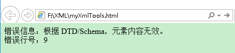

# xml约束
编写文档来约束一个XML文档的书写规范，这称之为XML约束

常用的约束技术有
- XML DTD
- XML Schema

## DTD

### 基本语法
```xml
<!ELEMENT 元素名 类型>

<!-- myClass.dtd文件 -->
<!ELEMENT 班级 (学生+)>
<!-- 表示根元素为班级，并且有学生这个子元素，子元素为1或者多个 -->
<!ELEMENT 学生 (名字,年龄,介绍)>
<!-- 表示学生的子元素为名字，年龄，介绍 -->
<!ELEMENT 名字 (#PCDATA)>
<!-- 名字下面没有子元素了，那么#PCDATA表示名字里面可以放任意文本 -->
<!ELEMENT 年龄 (#PCDATA)>
<!ELEMENT 介绍 (#PCDATA)>

<!-- 编写myClass.xml文件并引入DTD文件 -->
<?xml version="1.0" encoding="utf-8"?>
<!--引入dtd文件，约束这个xml-->
<!DOCTYPE 班级 SYSTEM "myClass.dtd">
<!-- SYSTEM，表示当前的DTD文件是本地的 -->
<!-- 如果写的是PUBLIC，则表示引入的DTD文件是来自于网络的 -->
<班级>
    <学生>
        <名字>周小星</名字>    
        <年龄>23</年龄>
        <介绍>学习刻苦</介绍>
    </学生>   
    <学生>
        <名字>林晓</名字> 
        <年龄>25</年龄>
        <介绍>是一个好学生</介绍>
    </学生>   
</班级>
```
这时候引入的DTD文件是没有产生作用的，如果我们在学生元素中添加子元素<面积>，打开这个XML文件，浏览器依然不会报错

我们需要编程校验XML文档的正确性，IE5以上的浏览器内置了XML解析工具：Microsoft.XMLDOM，开发人员可以编写JavaScript代码，利用这个解析工具装载XML文件，并对XML文件进行DTD验证，编写myXmlTools.html来对这个XML进行校验

```html
<html>
    <head>
    <!--自己编写一个简单的解析工具，去解析XML DTD是否配套-->     
    <script language="javascript">
        // 创建xml文档解析器对象
        var xmldoc = new ActiveXObject("Microsoft.XMLDOM");
        // 开启xml校验
        xmldoc.validateOnParse = "true";
        // 装载xml文档，即指定校验哪个XML文件
        xmldoc.load("myClass.xml");
        document.writeln("错误信息："+xmldoc.parseError.reason+"<br>");
        document.writeln("错误行号："+xmldoc.parseError.line);
    </script>

    </head>
    <body>

    </body>
</html>
```
用IE浏览器打开这个html文件,，可以看到运行结果



可以看到第9行正是我们添加的<面积>这一行

### DTD细节
#### 内部DTD文档
```xml
<!DOCTYPE 根元素 [定义内容]>
```
#### 外部DTD文档
当引用的DTD文件是本地文件的时候，用SYSTEM标识，并写上”DTD的文件路径”
```xml
<!DOCTYPE 根元素 SYSTEM "DTD文件路径">
```
如果引用的DTD文件是一个公共的文件时，采用PUBLIC标识
```xml
<!DOCTYPE 根元素 PUBLIC "DTD名称" "DTD文件的URL">
```

### DTD基本语法
```xml
<!ELEMENT NAME CONTENT>
```
- ELEMENT是关键字，是不能修改的 
- NAME表示元素名称 
- CONTENT是元素类型，必须要大写！CONTENT的内容有三种写法：
  - EMPTY——表示该元素不能包含子元素和文本，但可以有属性。 
  - ANY——表示该元素可以包含任何在该DTD中定义的元素内容 
  - #PCDATA——可以包含任何字符数据，但是不能在其中包含任何子元素

### 组合类型
```xml
<!ELEMENT 家庭(人+,家电*)>

<!-- xml -->
<家庭>
    <人 名字="张晓明" 性别="男" 年龄="25"/>
    <人 名字="李小钢" 性别="男" 年龄="36" 爱好="作个教育家和伟人"/>
    <家电 名称="彩电" 数量="3"/>
</家庭>
```
允许1到多个”人”这个子元素，也可以有0到多个”家电”这个子元素，加号星号与正则相同
符号|用途|示例|示例说明
--|--|--|--
()|用来给元素分组|(古龙\|金庸),(王朔\|余杰)|分成两组
\||在列出的对象中选择一个|(男人\|女人)|表示男人或者女人必须出现，两者至少选其一
+|该对象必须出现一次或者多次|(成员+)|表示成员必须出现，而却可以出现多个成员
*|该对象允许出现0次或者多次|(爱好*)|爱好可以出现两次到多次
?|该对象必须出现0次或者1次|(菜鸟?)|菜鸟可以出现，也可以不出现，如果出现的话，最多只能出现一次
,|对象必须按指定的顺序出现|(西瓜,苹果,香蕉)|表示西瓜、苹果、香蕉必须出现，并且按这个顺序出现

### DTD属性定义
```xml
<!ATTLIST 元素名称
    属性名称 类型 属性特点
    属性名称 类型 属性特点......  
>
```
### 属性的类型
- CDATA 表示属性值可以是任何字符(包括中文和数字)
- ID 表明该属性的取值必须是唯一的,但是属性的值不能是以数字开头(编号="Z001")
- IDREF/IDREFS 
  - IDREF 属性的值指向文档中其它地方声明的ID类型的值
  - IDREFS 同IDREF，但是可以具有由空格分开的多个引用
- Enumerated 事先定义好一些值，属性的值必须在所列出的值的范围内。
- ENTITY/ENTITIES 表示实体
  - 实体用于为一段内容创建一个别名，以后在XML文档中就可以使用别名引用这段内容了。 
  - 在DTD定义中，一条!ENTITY语句用于定义一个实体。 
  - 实体可分为两种类型：引用实体和参数实体。引用实体是被XML文档应用的，而参数实体是被DTD文件本身应用的。
    - 引用实体 引用实体主要在XML文档中被应用,引用实体的定义内容最好放在DTD文件的最后。`<!ENTITY 实体名称 "实体内容">`
    - 参数实体 参数实体被DTD文件自身使用,`<!ENTITY % 实体名称 "实体内容">`

```xml
<!ATTLIST person
    婚姻状态 (single|married|divorced|widowed) #IMPLIED
>
```

```xml
<!ENTITY % TAG_NAME "姓名|EMAIL|电话|地址">

<!ELEMENT 个人信息 (%TAG_NAME;|生日)>
<!ELEMENT 客户信息 (%TAG_NAME;|公司名)>
```
### 属性的特点
- #REQUIRED，表示这个属性必须给，不给就报错 
- #IMPLIED，表示这个属性可以给也可以不给 
- #FIXED value，表示这个属性必须给一个固定的value值 
- Default value，表示这个属性如果没有值，就分配一个默认的value值
[原文](https://blog.csdn.net/gavin_john/article/details/51532756)