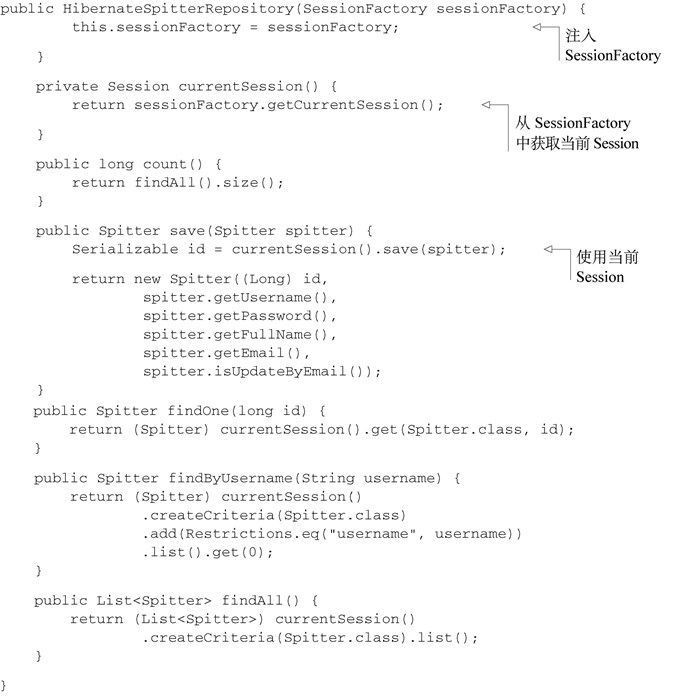
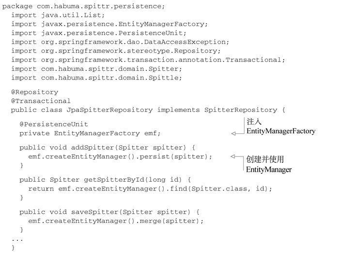
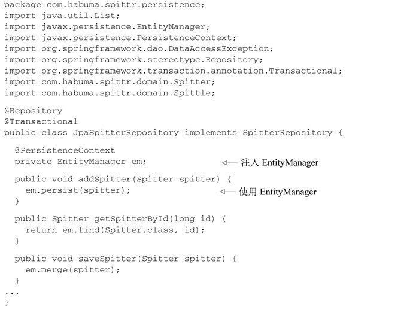

# 使用对象-关系映射持久化数据

在数据持久化的世界中，JDBC就像自行车。对于份内的工作，它能很好地完成并且在一些特定的场景下表现出色。但随着应用程序变得越来越复杂，对持久化的需求也变得更复杂。我们需要将对象的属性映射到数据库的列上，并且需要自动生成语句和查询，这样我们就能从无休止的问号字符串中解脱出来。

## 在Spring中集成Hibernate

### 声明Hibernate的Session工厂

使用Hibernate所需的主要接口是org.hibernate.Session。Session接口提供了基本的数据访问功能，如保存、更新、删除以及从数据库加载对象的功能。

Spring提供了三个Session工厂bean供我们选择
- org.springframework.orm.hibernate3.LocalSessionFactoryBean
- org.springframework.orm.hibernate3.annotation.AnnotationSessionFactoryBean
- org.springframework.orm.hibernate4.LocalSessionFactoryBean

```java
@Bean
public LocalSessionFactoryBean sessionFactory(DataSource dataSource) {
  LocalSessionFactoryBean sfb = new LocalSessionFactoryBean();
  sfb.setDataSource(dataSource);
  sfb.setMappingResources(new String[] { "Spitter.hbm.xml" });
  Properties props = new Properties();
  props.setProperty("dialect", "org.hibernate.dialect.H2Dialect");
  sfb.setHibernateProperties(props);
  return sfb;
}
```
- 属性dataSource装配了一个DataSource bean的引用。
- 属性mappingResources列出了一个或多个的Hibernate映射文件，在这些文件中定义了应用程序的持久化策略。
- hibernateProperties属性配置了Hibernate如何进行操作的细节。

使用注解的方式来定义持久化

```java
@Bean
public AnnotationSessionFactoryBean sessionFactory(DataSource ds) {
  AnnotationSessionFactoryBean sfb = new AnnotationSessionFactoryBean();
  sfb.setDataSource(ds);
  sfb.setPackagesToScan(new String[] { "com.habuma.spittr.domain" });
  Properties props = new Properties();
  props.setProperty("dialect", "org.hibernate.dialect.H2Dialect");
  sfb.setHibernateProperties(props);
  return sfb;
}
```

使用Hibernate 4,使用注解的方式来定义持久化

```java
@Bean
public LocalSessionFactoryBean sessionFactory(DataSource dataSource) {
  LocalSessionFactoryBean sfb = new LocalSessionFactoryBean();
  sfb.setDataSource(dataSource);
  sfb.setPackagesToScan(new String[] { "com.habuma.spittr.domain" });
  Properties props = new Properties();
  props.setProperty("dialect", "org.hibernate.dialect.H2Dialect");
  sfb.setHibernateProperties(props);
  return sfb;
}
```

### 借助Hibernate Session实现不依赖于Spring的Repository



>这图少截了开头类定义部分，最后多出了一个反花括号

- @Inject注解让Spring自动将一个SessionFactory注入到HibernateSpitterRepository的sessionFactory属性中。
- 在currentSession()方法中，我们使用这个SessionFactory来获取当前事务的Session。
- 在类上使用了@Repository注解，有两个用处：
  - 帮助减少显式配置：@Repository是Spring的另一种构造性注解，它能够像其他注解一样被Spring的组件扫描所扫描到。这样就不必明确声明HibernateSpitterRepository bean了。
  - 给不使用模板的Hibernate Repository添加异常转换功能

为了给不使用模板的Hibernate Repository添加异常转换功能，我们只需在Spring应用上下文中添加一个PersistenceExceptionTranslationPostProcessor bean：

```java
@Bean
public BeanPostProcessor persistenceTranslation() {
  return new PersistenceExceptionTranslationPostProcessor();
}
```
- PersistenceExceptionTranslationPostProcessor是一个bean 后置处理器（bean post-processor），它会在所有拥有@Repository注解的类上添加一个通知器（advisor），这样就会捕获任何平台相关的异常并以Spring非检查型数据访问异常的形式重新抛出。

## Spring与Java持久化API

Java持久化API（Java Persistence API，JPA）诞生在EJB 2实体Bean的废墟之上，并成为下一代Java持久化标准。JPA是基于POJO的持久化机制，它从Hibernate和Java数据对象（Java Data Object，JDO）上借鉴了很多理念并加入了Java 5注解的特性。

### 配置实体管理器工厂

在Spring中使用JPA的第一步是要在Spring应用上下文中将实体管理器工厂（entity manager factory）按照bean的形式来进行配置。

简单来讲，基于JPA的应用程序需要使用EntityManagerFactory的实现类来获取EntityManager实例。JPA定义了两种类型的实体管理器：
- 应用程序管理类型（Application-managed）：当应用程序向实体管理器工厂直接请求实体管理器时，工厂会创建一个实体管理器。在这种模式下，程序要负责打开或关闭实体管理器并在事务中对其进行控制。这种方式的实体管理器适合于不运行在Java EE容器中的独立应用程序。
- 容器管理类型（Container-managed）：实体管理器由Java EE创建和管理。应用程序根本不与实体管理器工厂打交道。相反，实体管理器直接通过注入或JNDI来获取。容器负责配置实体管理器工厂。这种类型的实体管理器最适用于Java EE容器，在这种情况下会希望在persistence.xml指定的JPA配置之外保持一些自己对JPA的控制。

以上的两种实体管理器实现了同一个EntityManager接口。关键的区别不在于EntityManager本身，而是在于EntityManager的创建和管理方式。应用程序管理类型的EntityManager是由EntityManagerFactory创建的，而后者是通过PersistenceProvider的createEntityManagerFactory()方法得到的。与此相对，容器管理类型的Entity ManagerFactory是通过PersistenceProvider的createContainerEntityManager Factory()方法获得的。

这对想使用JPA的Spring开发者来说又意味着什么呢？其实这并没太大的关系。不管你希望使用哪种EntityManagerFactory，Spring都会负责管理EntityManager。如果你使用的是应用程序管理类型的实体管理器，Spring承担了应用程序的角色并以透明的方式处理EntityManager。在容器管理的场景下，Spring会担当容器的角色。

这两种实体管理器工厂分别由对应的Spring工厂Bean创建：
- LocalEntityManagerFactoryBean生成应用程序管理类型的EntityManager-Factory；
- LocalContainerEntityManagerFactoryBean生成容器管理类型的Entity-ManagerFactory。

### 配置应用程序管理类型的JPA

绝大部分配置信息来源于一个名为persistence.xml的配置文件。这个文件必须位于类路径下的META-INF目录下。

```xml
<persistence xmlns="http://java.sun.com/xml/ns/persistence"
      version="1.0">
    <persistence-unit name="spitterPU">
      <class>com.habuma.spittr.domain.Spitter</class>
      <class>com.habuma.spittr.domain.Spittle</class>
      <properties>
        <property name="toplink.jdbc.driver"
            value="org.hsqldb.jdbcDriver" />
        <property name="toplink.jdbc.url" value=
            "jdbc:hsqldb:hsql://localhost/spitter/spitter" />
        <property name="toplink.jdbc.user"
            value="sa" />
        <property name="toplink.jdbc.password"
            value="" />
      </properties>
    </persistence-unit>
  </persistence>
```

通过以下的@Bean注解方法在Spring中声明LocalEntityManagerFactoryBean

```java
@Bean
public LocalEntityManagerFactoryBean entityManagerFactoryBean() {
  LocalEntityManagerFactoryBean emfb
      = new LocalEntityManagerFactoryBean();
  emfb.setPersistenceUnitName("spitterPU");
  return emfb;
}
```
- 赋给persistenceUnitName属性的值就是persistence.xml中持久化单元的名称。
- 创建应用程序管理类型的EntityManagerFactory都是在persistence.xml中进行的，而这正是应用程序管理的本意。

### 使用容器管理类型的JPA

容器管理的JPA采取了一个不同的方式。当运行在容器中时，可以使用容器（在我们的场景下是Spring）提供的信息来生成EntityManagerFactory。可以将数据源信息配置在Spring应用上下文中，而不是在persistence.xml中了。

下的@Bean注解方法声明了在Spring中如何使用LocalContainerEntity-ManagerFactoryBean来配置容器管理类型的JPA

```java
@Bean
public LocalContainerEntityManagerFactoryBean entityManagerFactory(
        DataSource dataSource, JpaVendorAdapter jpaVendorAdapter) {
  LocalContainerEntityManagerFactoryBean emfb =
      new LocalContainerEntityManagerFactoryBean();
  emfb.setDataSource(dataSource);
  emfb.setJpaVendorAdapter(jpaVendorAdapter);
  return emfb;
}
```
- 使用Spring配置的数据源来设置dataSource属性。
- jpaVendorAdapter bean的声明在下面给出

```java
@Bean
public JpaVendorAdapter jpaVendorAdapter() {
  HibernateJpaVendorAdapter adapter = new HibernateJpaVendorAdapter();
  adapter.setDatabase("HSQL");
  adapter.setShowSql(true);
  adapter.setGenerateDdl(false);
  adapter.setDatabasePlatform("org.hibernate.dialect.HSQLDialect");
  return adapter;
}
```
- 有多个属性需要设置到厂商适配器上，但是最重要的是database属性。在上面我们设置了要使用的数据库是Hypersonic。这个属性支持的其他值如下表所示

数据库平台|属性database的值
--|--
IBM DB2|DB2
Apache Derby|DERBY
H2|H2
Hypersonic|HSQL
Informix|INFORMIX
MySQL|MYSQL
Oracle|ORACLE
PostgresQL|POSTGRESQL
Microsoft SQL Server|SQLSERVER
Sybase|SYBASE

jpaVendorAdapter属性用于指明所使用的是哪一个厂商的JPA实现。Spring提供了多个JPA厂商适配器：
- EclipseLinkJpaVendorAdapter
- HibernateJpaVendorAdapter
- OpenJpaVendorAdapter

在LocalContainerEntityManagerFactoryBean中直接设置packagesToScan属性

```java
@Bean
public LocalContainerEntityManagerFactoryBean entityManagerFactory(
        DataSource dataSource, JpaVendorAdapter jpaVendorAdapter) {
  LocalContainerEntityManagerFactoryBean emfb =
      new LocalContainerEntityManagerFactoryBean();
  emfb.setDataSource(dataSource);
  emfb.setJpaVendorAdapter(jpaVendorAdapter);
  emfb.setPackagesToScan("com.habuma.spittr.domain");
  return emfb;
}
```
- 在这个配置中，LocalContainerEntityManagerFactoryBean会扫描com.habuma.spittr.domain包，查找带有@Entity注解的类。因此，没有必要在persistence.xml文件中进行声明了。
- 同时，因为DataSource也是注入到LocalContainer-EntityManager FactoryBean中的，所以也没有必要在persistence.xml文件中配置数据库信息了。那么结论就是，persistence.xml文件完全没有必要存在了

### 从JNDI获取实体管理器工厂

```java
@Bean
public JndiObjectFactoryBean entityManagerFactory() {}
JndiObjectFactoryBean jndiObjectFB = new JndiObjectFactoryBean();
  jndiObjectFB.setJndiName("jdbc/SpittrDS");
  return jndiObjectFB;
}
```

尽管这种方法没有返回EntityManagerFactory，但是它的结果就是一个EntityManagerFactory bean。这是因为它所返回的JndiObjectFactoryBean是FactoryBean接口的实现，它能够创建EntityManagerFactory。

### 编写基于JPA的Repository

不使用Spring模板的纯JPA Repository



- EntityManagerFactory属性，它使用了@PersistenceUnit注解，因此，Spring会将EntityManagerFactory注入到Repository之中
- 每个方法都会调用createEntityManager()。除了引入易出错的重复代码以外，这还意味着每次调用Repository的方法时，都会创建一个新的EntityManager。

借助@PersistentContext注解为JpaSpitterRepository设置EntityManager,将EntityManager的代理注入到Repository之中



- 在这个新版本的JpaSpitterRepository中，直接为其设置了EntityManager，这样的话，在每个方法中就没有必要再通过EntityManagerFactory创建EntityManager了。
- @PersistenceContext并不会真正注入EntityManager——至少，精确来讲不是这样的。它没有将真正的EntityManager设置给Repository，而是给了它一个EntityManager的代理。真正的EntityManager是与当前事务相关联的那一个，如果不存在这样的EntityManager的话，就会创建一个新的。这样的话，我们就能始终以线程安全的方式使用实体管理器。
- 另外，还需要了解@PersistenceUnit和@PersistenceContext并不是Spring的注解，它们是由JPA规范提供的。为了让Spring理解这些注解，并注入EntityManager Factory或EntityManager，我们必须要配置Spring的Persistence-AnnotationBeanPostProcessor

```java
@Bean
public PersistenceAnnotationBeanPostProcessor paPostProcessor() {
  return new PersistenceAnnotationBeanPostProcessor();
}
```

## 借助Spring Data实现自动化的JPA Repository

借助Spring Data，以接口定义的方式创建Repository

```java
public interface SpitterRepository
         extends JpaRepository<Spitter, Long> {
}
```
- 编写Spring Data JPA Repository的关键在于要从一组接口中挑选一个进行扩展。这里，SpitterRepository扩展了Spring Data JPA的JpaRepository
- 通过这种方式，JpaRepository进行了参数化，所以它就能知道这是一个用来持久化Spitter对象的Repository，并且Spitter的ID类型为Long。另外，它还会继承18个执行持久化操作的通用方法，如保存Spitter、删除Spitter以及根据ID查询Spitter。

我们不需要编写SpitterRepository的任何实现类,Spring Data会创建SpitterRepository的实现。我们需要在Spring中添加配置类

```java
@Configuration
@EnableJpaRepositories(basePackages="com.habuma.spittr.db")
public class JpaConfiguration {
  ...
}
```
- 它使用了@EnableJpaRepositories注解，并且会扫描com.habuma.spittr.db包：
- 回到SpitterRepository接口，它扩展自JpaRepository，而JpaRepository又扩展自Repository标记接口（虽然是间接的）。因此，SpitterRepository就传递性地扩展了Repository接口，也就是Repository扫描时所要查找的接口。当Spring Data找到它后，就会创建SpitterRepository的实现类，其中包含了继承自JpaRepository、PagingAndSortingRepository和CrudRepository的18个方法。
- 很重要的一点在于Repository的实现类是在应用启动的时候生成的，也就是Spring的应用上下文创建的时候。它并不是在构建时通过代码生成技术产生的，也不是接口方法调用时才创建的。


Spring Data JPA很棒的一点在于它能为Spitter对象提供18个便利的方法来进行通用的JPA操作，而无需你编写任何持久化代码。但是，如果你的需求超过了它所提供的这18个方法的话，该怎么办呢？幸好，Spring Data JPA提供了几种方式来为Repository添加自定义的方法。让我们看一下如何为Spring Data JPA编写自定义的查询方法。


### 定义查询方法

现在，SpitterRepository需要完成的一项功能是根据给定的username查找Spitter对象。

```java
public interface SpitterRepository
       extends JpaRepository<Spitter, Long> {
    Spitter findByUsername(String username);
  }
```
- 当创建Repository实现的时候，Spring Data会检查Repository接口的所有方法，解析方法的名称，并基于被持久化的对象来试图推测方法的目的。
- Spring Data能够知道这个方法是要查找Spitter的，因为我们使用Spitter对JpaRepository进行了参数化。方法名findByUsername确定该方法需要根据username属性相匹配来查找Spitter，而username是作为参数传递到方法中来的。另外，因为在方法签名中定义了该方法要返回一个Spitter对象，而不是一个集合，因此它只会查找一个username属性匹配的Spitter。
- findByUsername()方法非常简单，但是Spring Data也能处理更加有意思的方法名称。Repository方法是由一个动词、一个可选的主题（Subject）、关键词By以及一个断言所组成。在findByUsername()这个样例中，动词是find，断言是Username，主题并没有指定，暗含的主题是Spitter。


