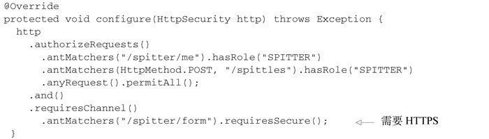
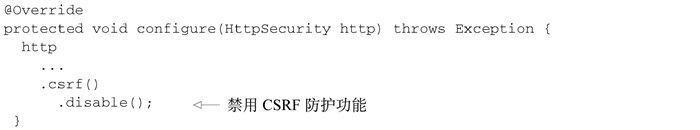
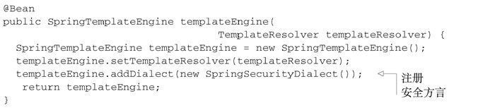

# 保护Web应用

## Spring Security简介

### 过滤Web请求

借助WebApplicationInitializer以Java的方式来配置Delegating-FilterProxy

```java
package spitter.config;
import org.springframework.security.web.context.
                             AbstractSecurityWebApplicationInitializer;
public class SecurityWebInitializer
       extends AbstractSecurityWebApplicationInitializer {}
```
- AbstractSecurityWebApplicationInitializer实现了WebApplication-Initializer，因此Spring会发现它，并用它在Web容器中注册DelegatingFilterProxy。尽管我们可以重载它的appendFilters()或insertFilters()方法来注册自己选择的Filter
- 不管我们通过web.xml还是通过AbstractSecurityWebApplicationInitializer的子类来配置DelegatingFilterProxy，它都会拦截发往应用中的请求，并将请求委托给ID为springSecurityFilterChain bean。

### 编写简单的安全性配置

启用Web安全性功能的最简单配置

```java
package spittr.config;

import org.springframework.context.annotation.Configuration;
import org.springframework.http.HttpMethod;
import org.springframework.security.config.annotation.authentication.builders.AuthenticationManagerBuilder;
import org.springframework.security.config.annotation.web.builders.HttpSecurity;
import org.springframework.security.config.annotation.web.configuration.WebSecurityConfigurerAdapter;
import org.springframework.security.config.annotation.web.servlet.configuration.EnableWebMvcSecurity;
import org.springframework.security.web.authentication.rememberme.InMemoryTokenRepositoryImpl;

@Configuration
@EnableWebMvcSecurity
public class SecurityConfig extends WebSecurityConfigurerAdapter {
  
  @Override
  protected void configure(HttpSecurity http) throws Exception {
    http
      .formLogin()
        .loginPage("/login")
      .and()
        .logout()
          .logoutSuccessUrl("/")
      .and()
      .rememberMe()
        .tokenRepository(new InMemoryTokenRepositoryImpl())
        .tokenValiditySeconds(2419200)
        .key("spittrKey")
      .and()
       .httpBasic()
         .realmName("Spittr")
      .and()
      .authorizeRequests()
        .antMatchers("/").authenticated()
        .antMatchers("/spitter/me").authenticated()
        .antMatchers(HttpMethod.POST, "/spittles").authenticated()
        .anyRequest().permitAll();
  }
  
  @Override
  protected void configure(AuthenticationManagerBuilder auth) throws Exception {
    auth
      .inMemoryAuthentication()
        .withUser("user").password("password").roles("USER");
  }

  
}
```
- 如果它没有重写下面三个configure()方法中的任何一个，那么应用将被严格锁定，导致没有人能够进入该系统
- 通过重载WebSecurityConfigurerAdapter中的一个或多个方法来实现Web安全的细节,这个过程中会使用传递进来的参数设置行为。

方法|描述
--|--
configure(WebSecurity)|通过重载，配置Spring Security的Filter链
configure(HttpSecurity)|通过重载，配置如何通过拦截器保护请求
configure(AuthenticationManagerBuilder)|通过重载，配置user-detail服务

## 选择查询用户详细信息的服务

### 使用基于内存的用户存储

因为我们的安全配置类扩展了WebSecurityConfigurerAdapter，因此配置用户存储的最简单方式就是重载configure()方法，并以AuthenticationManagerBuilder作为传入参数。AuthenticationManagerBuilder有多个方法可以用来配置Spring Security对认证的支持。通过inMemoryAuthentication()方法，我们可以启用、配置并任意填充基于内存的用户存储。

```java

@Override
protected void configure(AuthenticationManagerBuilder auth) throws Exception {
auth
    .inMemoryAuthentication()
    .withUser("user").password("password").roles("USER").and()
    .withUser("admin").password("password").roles("USER","ADMIN");
}
```
- 调用inMemoryAuthentication()就能启用内存用户存储
- 调用withUser()方法为内存用户存储添加新的用户，这个方法的参数是username。withUser()方法返回的是UserDetailsManagerConfigurer.UserDetailsBuilder，这个对象提供了多个进一步配置用户的方法，包括设置用户密码的password()方法以及为给定用户授予一个或多个角色权限的roles()方法。
- roles("USER")方法是authorities("ROLE_USER")方法的简写形式，会自动为角色添加ROLE_前缀。
- and()方法能够将多个用户的配置连接起来。

除了password()、roles()和and()方法以外，还有其他的几个方法可以用来配置内存用户存储中的用户信息。

方法|描述
--|--
accountExpired(boolean)|定义账号是否已经过期
accountLocked(boolean)|定义账号是否已经锁定
and()|用来连接配置
authorities(GrantedAuthority...)|授予某个用户一项或多项权限
authorities(List<? extends GrantedAuthority>)|授予某个用户一项或多项权限
authorities(String...)|授予某个用户一项或多项权限
credentialsExpired(boolean)|定义凭证是否已经过期
disabled(boolean)|定义账号是否已被禁用
password(String)|定义用户的密码
roles(String...)|授予某个用户一项或多项角色

### 基于数据库表进行认证

```java
@Autowired
DataSource dataSource;

@Override
protected void configure(AuthenticationManagerBuilder auth)
                                                   throws Exception {
  auth
    .jdbcAuthentication()
      .dataSource(dataSource);
}
```

重写默认的用户查询功能

```java
public static final String DEF_USERS_BY_USERNAME_QUERY =
        "select username,password,enabled " +
        "from users " +
        "where username = ?";
public static final String DEF_AUTHORITIES_BY_USERNAME_QUERY =
        "select username,authority " +
        "from authorities " +
        "where username = ?";
public static final String DEF_GROUP_AUTHORITIES_BY_USERNAME_QUERY =
        "select g.id, g.group_name, ga.authority " +
        "from groups g, group_members gm, group_authorities ga " +
        "where gm.username = ? " +
        "and g.id = ga.group_id " +
        "and g.id = gm.group_id";
```
- 在第一个查询中，我们获取了用户的用户名、密码以及是否启用的信息，这些信息会用来进行用户认证。
- 接下来的查询查找了用户所授予的权限，用来进行鉴权，
- 最后一个查询中，查找了用户作为群组的成员所授予的权限。

可能你的数据库与上面所述并不一致，那么你就会希望在查询上有更多的控制权。

```java
@Override
protected void configure(AuthenticationManagerBuilder auth)
                                                   throws Exception {
  auth
    .jdbcAuthentication()
      .dataSource(dataSource)
      .usersByUsernameQuery(
        "select username, password, true " +
        "from Spitter where username=?")
      .authoritiesByUsernameQuery(
        "select username, 'ROLE_USER' from Spitter where username=?");
}
```
- 我们只重写了认证和基本权限的查询语句，但是通过调用group-AuthoritiesByUsername()方法，我们也能够将群组权限重写为自定义的查询语句。
- 将默认的SQL查询替换为自定义的设计时，很重要的一点就是要遵循查询的基本协议。所有查询都将用户名作为唯一的参数。认证查询会选取用户名、密码以及启用状态信息。权限查询会选取零行或多行包含该用户名及其权限信息的数据。群组权限查询会选取零行或多行数据，每行数据中都会包含群组ID、群组名称以及权限。

### 使用转码后的密码

看一下上面的认证查询，它会预期用户密码存储在了数据库之中。这里唯一的问题在于如果密码明文存储的话，会很容易受到黑客的窃取。但是，如果数据库中的密码进行了转码的话，那么认证就会失败，因为它与用户提交的明文密码并不匹配。

为了解决这个问题，我们需要借助passwordEncoder()方法指定一个密码转码器（encoder）

```java
@Override
protected void configure(AuthenticationManagerBuilder auth)
                                                   throws Exception {
  auth
    .jdbcAuthentication()
      .dataSource(dataSource)
      .usersByUsernameQuery(
        "select username, password, true " +
        "from Spitter where username=?")
      .authoritiesByUsernameQuery(
        "select username, 'ROLE_USER' from Spitter where username=?")
      .passwordEncoder(new StandardPasswordEncoder("53cr3t"));
}
```
- passwordEncoder()方法可以接受Spring Security中PasswordEncoder接口的任意实现。Spring Security的加密模块包括了三个这样的实现：BCryptPasswordEncoder、NoOpPasswordEncoder和StandardPasswordEncoder。

上述的代码中使用了StandardPasswordEncoder，但是如果内置的实现无法满足需求时，你可以提供自定义的实现。PasswordEncoder接口非常简单：

```java
public interface PasswordEncoder {
  String encode(CharSequence rawPassword);
  boolean matches(CharSequence rawPassword, String encodedPassword);
}
```

不管你使用哪一个密码转码器，都需要理解的一点是，数据库中的密码是永远不会解码的。所采取的策略与之相反，用户在登录时输入的密码会按照相同的算法进行转码，然后再与数据库中已经转码过的密码进行对比。这个对比是在PasswordEncoder的matches()方法中进行的。

## 拦截请求

对每个请求进行细粒度安全性控制的关键在于重载configure(HttpSecurity)方法。为不同的URL路径有选择地应用安全性：

```java
@Override
protected void configure(HttpSecurity http) throws Exception {
  http
    .authorizeRequests()
      .antMatchers("/spitters/me").authenticated()
      .antMatchers(HttpMethod.POST, "/spittles").authenticated()
      .anyRequest().permitAll();
}
```
- 我们首先调用authorizeRequests()，然后调用该方法所返回的对象的方法来配置请求级别的安全性细节。
- 其中，第一次调用antMatchers()指定了对“/spitters/me”路径的请求需要进行认证。
- 第二次调用antMatchers()更为具体，说明对“/spittles”路径的HTTP POST请求必须要经过认证。
- 最后对anyRequests()的调用中，说明其他所有的请求都是允许的，不需要认证和任何的权限。
- antMatchers()方法也可以使用通配符来指定路径 `.antMatchers("/spitters/**").authenticated();`
- 在一个对antMatchers()方法的调用中指定多个路径： `.antMatchers("/spitters/**", "/spittles/mine").authenticated();`
- regexMatchers()方法则能够接受正则表达式来定义请求路径。 `.regexMatchers("/spitters/.*").authenticated();`
- authenticated()要求在执行该请求时，必须已经登录了应用。如果用户没有认证的话，Spring Security的Filter将会捕获该请求，并将用户重定向到应用的登录页面。
- permitAll()方法允许请求没有任何的安全限制。

除了authenticated()和permitAll()以外，还有其他的一些方法能够用来定义该如何保护请求

方法|能够做什么
--|--
access(String)|如果给定的SpEL表达式计算结果为true，就允许访问
anonymous()|允许匿名用户访问
authenticated()|允许认证过的用户访问
denyAll()|无条件拒绝所有访问
fullyAuthenticated()|如果用户是完整认证的话（不是通过Remember-me功能认证的），就允许访问
hasAnyAuthority(String...)|如果用户具备给定权限中的某一个的话，就允许访问
hasAnyRole(String...)|如果用户具备给定角色中的某一个的话，就允许访问
hasAuthority(String)|如果用户具备给定权限的话，就允许访问
hasIpAddress(String)|如果请求来自给定IP地址的话，就允许访问
hasRole(String)|如果用户具备给定角色的话，就允许访问
not()|对其他访问方法的结果求反
permitAll()|无条件允许访问
rememberMe()|如果用户是通过Remember-me功能认证的，就允许访问

同时验证登陆和权限

```java
@Override
protected void configure(HttpSecurity http) throws Exception {
  http
    .authorizeRequests()
      .antMatchers("/spitters/me").hasAuthority("ROLE_SPITTER")
      .antMatchers(HttpMethod.POST, "/spittles")
                                  .hasAuthority("ROLE_SPITTER")
      .anyRequest().permitAll();
}

// 或

@Override
protected void configure(HttpSecurity http) throws Exception {
  http
    .authorizeRequests()
      .antMatchers("/spitter/me").hasRole("SPITTER")
      .antMatchers(HttpMethod.POST, "/spittles").hasRole("SPITTER")
      .anyRequest().permitAll();
}
```
- 我们可以将任意数量的antMatchers()、regexMatchers()和anyRequest()连接起来，以满足Web应用安全规则的需要。但是，我们需要知道，这些规则会按照给定的顺序发挥作用。所以，很重要的一点就是将最为具体的请求路径放在前面，而最不具体的路径（如anyRequest()）放在最后面。如果不这样做的话，那不具体的路径配置将会覆盖掉更为具体的路径配置。

### 使用Spring表达式进行安全保护

上表中的大多数方法都是一维的，也就是说我们可以使用hasRole()限制某个特定的角色，但是我们不能在相同的路径上同时通过hasIpAddress()限制特定的IP地址。

另外使用表中的方法无法实现自定义条件，如限制某个角色只能在星期二访问。

借助access()方法，我们也可以将SpEL作为声明访问限制的一种方式。

```java
.antMatchers("/spitter/me").access("hasRole('ROLE_SPITTER')")
```

Spring Security通过一些安全性相关的表达式扩展了Spring表达式语言

安全表达式|计 算 结 果
--|--
authentication|用户的认证对象
denyAll|结果始终为false
hasAnyRole(list of roles)|如果用户被授予了列表中任意的指定角色，结果为true
hasRole(role)|如果用户被授予了指定的角色，结果为true
hasIpAddress(IP Address)|如果请求来自指定IP的话，结果为true
isAnonymous()|如果当前用户为匿名用户，结果为true
isAuthenticated()|如果当前用户进行了认证的话，结果为true
isFullyAuthenticated()|如果当前用户进行了完整认证的话（不是通过Remember-me功能进行的认证），结果为true
isRememberMe()|如果当前用户是通过Remember-me自动认证的，结果为true
permitAll|结果始终为true
principal|用户的principal对象


同时限制两个条件

```java
.antMatchers("/spitter/me")
  .access("hasRole('ROLE_SPITTER') and hasIpAddress('192.168.1.1')")
```

### 强制通道的安全性

requiresChannel()方法会为选定的URL强制使用HTTPS



使用requiresInsecure()代替requiresSecure()方法，将首页声明为始终通过HTTP传送：

```java
.antMatchers("/").requiresInecure();
```

### 防止跨站请求伪造

当一个POST请求提交到“/spittles”上时，SpittleController将会为用户创建一个新的Spittle对象。但是，如果这个POST请求来源于其他站点的话，会怎么样呢？如果在其他站点提交如下表单，这个POST请求会造成什么样的结果呢？

```html
<form method="POST" action="http://www.spittr.com/spittles">
  <input type="hidden" name="message" value="I'm stupid!" />
  <input type="submit" value="Click here to win a new car!" />
</form>
```

Spring Security通过一个同步token的方式来实现CSRF防护的功能。它将会拦截状态变化的请求（例如，非GET、HEAD、OPTIONS和TRACE的请求）并检查CSRF token。如果请求中不包含CSRF token的话，或者token不能与服务器端的token相匹配，请求将会失败，并抛出CsrfException异常。

这意味着在你的应用中，所有的表单必须在一个“_csrf”域中提交token，而且这个token必须要与服务器端计算并存储的token一致，这样的话当表单提交的时候，才能进行匹配。

好消息是，Spring Security已经简化了将token放到请求的属性中这一任务。如果你使用Thymeleaf作为页面模板的话，只要<form>标签的action属性添加了Thymeleaf命名空间前缀，那么就会自动生成一个“_csrf”隐藏域：

```html
<form method="POST" th:action="@{/spittles}">
   ...
</form>
```

禁用Spring Security的CSRF防护功能



## 认证用户

### 添加自定义的登录页

重写了configure(HttpSecurity)方法后，要在configure(HttpSecurity)方法中，调用formLogin()

```java
http
    .formLogin()
      .loginPage("/login")
```

`login.html`

```html
<html xmlns="http://www.w3.org/1999/xhtml"
      xmlns:th="http://www.thymeleaf.org">
  <head>
    <title>Spitter</title>
    <link rel="stylesheet" 
          type="text/css" 
          th:href="@{/resources/style.css}"></link>
  </head>
  <body onload='document.f.username.focus();'>
    <div id="header" th:include="page :: header"></div>

  <div id="content">
  
    <a th:href="@{/spitter/register}">Register</a>
  
  
  <form name='f' th:action='@{/login}' method='POST'>
   <table>
    <tr><td>User:</td><td>
        <input type='text' name='username' value='' /></td></tr>
    <tr><td>Password:</td>
        <td><input type='password' name='password'/></td></tr>
    <tr><td colspan='2'>
    <input id="remember_me" name="remember-me" type="checkbox"/>
    <label for="remember_me" class="inline">Remember me</label></td></tr>
    <tr><td colspan='2'>
        <input name="submit" type="submit" value="Login"/></td></tr>
   </table>
  </form>
  </div>
  <div id="footer" th:include="page :: copy"></div>
  </body>
</html>
```

### 启用HTTP Basic认证

用于使用代码访问RESTful API时进行认证，当在Web浏览器中使用时，它将向用户弹出一个简单的模态对话框。

但这只是Web浏览器的显示方式。本质上，这是一个HTTP 401响应，表明必须要在请求中包含一个用户名和密码。

启用HTTP Basic认证，在configure()方法所传入的HttpSecurity对象上调用httpBasic()即可。还可以通过调用realmName()方法指定域。

```java
@Override
protected void configure(HttpSecurity http) throws Exception {
  http
    .formLogin()
      .loginPage("/login")
    .and()
    .httpBasic()
      .realmName("Spittr")
    .and()
  ...
}
```

### 启用Remember-me功能

简化登陆，无需再次登陆

启用这项功能，只需在configure()方法所传入的HttpSecurity对象上调用rememberMe()即可。

```java
@Override
  protected void configure(HttpSecurity http) throws Exception {
    http
      .formLogin()
        .loginPage("/login")
      .and()
      .rememberMe()
        .tokenValiditySeconds(2419200)
        .key("spittrKey")
  ...
}
```
- 默认情况下，这个功能是通过在cookie中存储一个token完成的，这个token最多两周内有效。但是，在这里，我们指定这个token最多四周内有效（2,419,200秒）。
- 存储在cookie中的token包含用户名、密码、过期时间和一个私钥——在写入cookie前都进行了MD5哈希。默认情况下，私钥的名为SpringSecured，但在这里我们将其设置为spitterKey，使它专门用于Spittr应用。

如此简单。既然Remember-me功能已经启用，我们需要有一种方式来让用户表明他们希望应用程序能够记住他们。为了实现这一点，登录请求必须包含一个名为remember-me的参数。在登录表单中，增加一个简单复选框就可以完成这件事情：

```html
<input id="remember_me" name="remember-me" type="checkbox"/>
<label for="remember_me" class="inline">Remember me</label>
```

### 退出功能

退出功能是通过Servlet容器中的Filter实现的（默认情况下），这个Filter会拦截针对“/logout”的请求。因此，为应用添加退出功能只需添加如下的链接即可

```html
<a th:href="@{/logout}">Logout</a>
```
- 当用户点击这个链接的时候，会发起对“/logout”的请求，这个请求会被Spring Security的LogoutFilter所处理。用户会退出应用，所有的Remember-me token都会被清除掉。在退出完成后，用户浏览器将会重定向到“/login?logout”，从而允许用户进行再次登录。
- 如果你希望用户被重定向到其他的页面，如应用的首页，那么可以在configure()中进行如下的配置：

```java
@Override
protected void configure(HttpSecurity http) throws Exception {
  http
    .formLogin()
      .loginPage("/login")
    .and()
    .logout()
      .logoutSuccessUrl("/")
  ...
}
```

除了logoutSuccessUrl()方法以外，你可能还希望重写默认的LogoutFilter拦截路径。我们可以通过调用logoutUrl()方法实现这一功能：

```java
.logout()
  .logoutSuccessUrl("/")
  .logoutUrl("/signout")
```

## 保护视图

根据用户被授予了什么权限，有条件地渲染特定的视图元素。

Thymeleaf的安全方言提供了与Spring Security标签库相对应的属性

属性|作用
--|--
sec:authentication|渲染认证对象的属性。类似于Spring Security的<sec:authentication/>JSP标签
sec:authorize|基于表达式的计算结果，条件性的渲染内容。类似于Spring Security的<sec:authorize/>JSP标签
sec:authorize-acl|基于表达式的计算结果，条件性的渲染内容。类似于Spring Security的<sec:accesscontrollist/> JSP标签
sec:authorize-expr|sec:authorize属性的别名
sec:authorize-url|基于给定URL路径相关的安全规则，条件性的渲染内容。类似于Spring Security的<sec:authorize/> JSP标签使用url属性时的场景

首先在配置中使用SpringTemplateEngine来注册SpringSecurity Dialect。声明SpringTemplateEngine bean，其中包含SpringSecurityDialect。



声明安全命名空间

```html
<!DOCTYPE html>
<html xmlns="http://www.w3.org/1999/xhtml"
      xmlns:th="http://www.thymeleaf.org"
      xmlns:sec=
          "http://www.thymeleaf.org/thymeleaf-extras-springsecurity3">
  ...
</html>
```

为认证用户渲染“Hello”文本

```html
<div sec:authorize="isAuthenticated()">
  Hello <span sec:authentication="name">someone</span>
</div>
```
- sec:authorize属性会接受一个SpEL表达式。如果表达式的计算结果为true，那么元素的主体内容就会渲染。

基于给定URL的权限有条件地渲染内容。

```html
<span sec:authorize-url="/admin">
  <br/><a th:href="@{/admin}">Admin</a>
</span>
```
- 如果用户有权限访问“/admin”的话，那么到管理页面的链接就会渲染，否则的话，这个链接将不会渲染。


