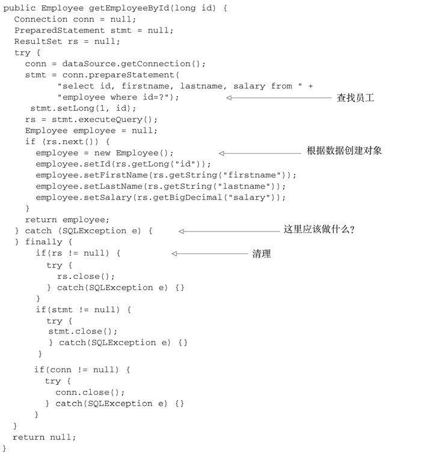
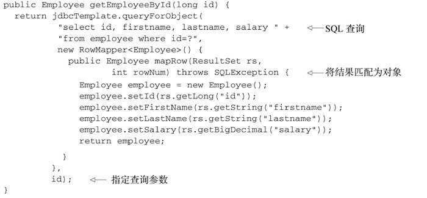

# spring简单用例

## 1.依赖注入

构造器注入

`knight/src/main/java/sia/knights/Knight.java`

```java
package sia.knights;

public interface Knight {

  void embarkOnQuest();

}
```

`knight/src/main/java/sia/knights/Quest.java`

```java
package sia.knights;

public interface Quest {

  void embark();

}
```

`knight/src/main/java/sia/knights/BraveKnight.java`

```java
package sia.knights;
  
public class BraveKnight implements Knight {

  private Quest quest;

  public BraveKnight(Quest quest) {
    this.quest = quest;
  }

  public void embarkOnQuest() {
    quest.embark();
  }

}
```

`knight/src/main/java/sia/knights/SlayDragonQuest.java`

```java
package sia.knights;

import java.io.PrintStream;

public class SlayDragonQuest implements Quest {

  private PrintStream stream;

  public SlayDragonQuest(PrintStream stream) {
    this.stream = stream;
  }

  public void embark() {
    stream.println("Embarking on quest to slay the dragon!");
  }

}
```

`knight/src/main/java/sia/knights/KnightMain.java`

```java
package sia.knights;

import org.springframework.context.support.
                   ClassPathXmlApplicationContext;

public class KnightMain {

  public static void main(String[] args) throws Exception {
    ClassPathXmlApplicationContext context = 
        new ClassPathXmlApplicationContext(
            "META-INF/spring/knight.xml");
    Knight knight = context.getBean(Knight.class);
    knight.embarkOnQuest();
    context.close();
  }

}
```
- 这里的main()方法基于knights.xml文件创建了Spring应用上下文。随后它调用该应用上下文获取一个ID为knight的bean。得到Knight对象的引用后，只需简单调用embarkOnQuest()方法就可以执行所赋予的探险任务了。
- Spring自带了多种类型的应用上下文。下面罗列的几个是你最有可能遇到的。
  - AnnotationConfigApplicationContext：从一个或多个于Java的配置类中加载Spring应用上下文。
  - AnnotationConfigWebApplicationContext：从一个或多个基于Java的配置类中加载Spring Web应用上下文。
  - ClassPathXmlApplicationContext：从类路径下的一个或多个XML配置文件中加载上下文定义，把应用上下文的定义文件作为类资源。
  - FileSystemXmlapplicationcontext：从文件系统下的一个或多个XML配置文件中加载上下文定义。
  - XmlWebApplicationContext：从Web应用下的一个或多个XML配置文件中加载上下文定义。

```java
ApplicationContext context = new AnnotationConfigApplicationContext(
    com.springinaction.knights.config.KnightConfig.class);
ApplicationContext context = new
        FileSystemXmlApplicationContext("c:/knight.xml");
ApplicationContext context = new
        ClassPathXmlApplicationContext("knight.xml");
```

`knight/src/main/resources/META-INF/spring/knight.xml`

```xml
<?xml version="1.0" encoding="UTF-8"?>
<beans xmlns="http://www.springframework.org/schema/beans"
  xmlns:xsi="http://www.w3.org/2001/XMLSchema-instance"
  xsi:schemaLocation="http://www.springframework.org/schema/beans 
      http://www.springframework.org/schema/beans/spring-beans.xsd">

  <bean id="knight" class="sia.knights.BraveKnight">
    <constructor-arg ref="quest" />
  </bean>

  <bean id="quest" class="sia.knights.SlayDragonQuest">
    <constructor-arg value="#{T(System).out}" />
  </bean>

</beans>
```
- 在这里，BraveKnight和SlayDragonQuest被声明为Spring中的bean。就BraveKnight bean来讲，它在构造时传入了对SlayDragonQuest bean的引用，将其作为构造器参数。同时，SlayDragonQuest bean的声明使用了Spring表达式语言（Spring Expression Language），将System.out（这是一个PrintStream）传入到了SlayDragonQuest的构造器中。
- 如果XML配置不符合你的喜好的话，Spring还支持使用Java来描述配置。

`knight/src/main/java/sia/knights/config/KnightConfig.java`

```java
package sia.knights.config;

import org.springframework.context.annotation.Bean;
import org.springframework.context.annotation.Configuration;

import sia.knights.BraveKnight;
import sia.knights.Knight;
import sia.knights.Quest;
import sia.knights.SlayDragonQuest;

@Configuration
public class KnightConfig {

  @Bean
  public Knight knight() {
    return new BraveKnight(quest());
  }
  
  @Bean
  public Quest quest() {
    return new SlayDragonQuest(System.out);
  }

}
```
- 这个样例展现了在Spring中装配bean的一种简单方法。本例主要展示的是xml配置，java可视化配置和自动配置稍后介绍。

## 2.应用切面

在骑士类执行方法前后添加切面。

`knight/src/main/java/sia/knights/Minstrel.java`

```java
package sia.knights;

import java.io.PrintStream;

public class Minstrel {

  private PrintStream stream;
  
  public Minstrel(PrintStream stream) {
    this.stream = stream;
  }
  
  // 探险之前调用
  public void singBeforeQuest() {
    stream.println("Fa la la, the knight is so brave!");
  }

  // 探险之后调用
  public void singAfterQuest() {
    stream.println("Tee hee hee, the brave knight " +
    		"did embark on a quest!");
  }

}
```

`knight/src/main/resources/META-INF/spring/minstrel.xml`

```xml
<?xml version="1.0" encoding="UTF-8"?>
<beans xmlns="http://www.springframework.org/schema/beans"
  xmlns:xsi="http://www.w3.org/2001/XMLSchema-instance"
  xmlns:aop="http://www.springframework.org/schema/aop"
  xsi:schemaLocation="http://www.springframework.org/schema/aop 
      http://www.springframework.org/schema/aop/spring-aop.xsd
		http://www.springframework.org/schema/beans 
      http://www.springframework.org/schema/beans/spring-beans.xsd">

  <bean id="knight" class="sia.knights.BraveKnight">
    <constructor-arg ref="quest" />
  </bean>

  <bean id="quest" class="sia.knights.SlayDragonQuest">
    <constructor-arg value="#{T(System).out}" />
  </bean>

  <bean id="minstrel" class="sia.knights.Minstrel">
    <constructor-arg value="#{T(System).out}" />
  </bean>

  <aop:config>
    <aop:aspect ref="minstrel">
      <aop:pointcut id="embark"
          expression="execution(* *.embarkOnQuest(..))"/>
        
      <aop:before pointcut-ref="embark" 
          method="singBeforeQuest"/>

      <aop:after pointcut-ref="embark" 
          method="singAfterQuest"/>
    </aop:aspect>
  </aop:config>
  
</beans>
```
- 这里使用了Spring的aop配置命名空间把Minstrel bean声明为一个切面。首先，需要把Minstrel声明为一个bean，然后在<aop:aspect>元素中引用该bean。为了进一步定义切面，声明（使用<aop:before>）在embarkOnQuest()方法执行前调用Minstrel的singBeforeQuest()方法。这种方式被称为前置通知（before advice）。同时声明（使用<aop:after>）在embarkOnQuest()方法执行后调用singAfter Quest()方法。这种方式被称为后置通知（after advice）。
- 在这两种方式中，pointcut-ref属性都引用了名字为embark的切入点。该切入点是在前边的<pointcut>元素中定义的，并配置expression属性来选择所应用的通知。表达式的语法采用的是AspectJ的切点表达式语言。

## 3.使用模板消除样板式代码

样板式代码的一个常见范例是使用JDBC访问数据库查询数据。



Spring旨在通过模板封装来消除样板式代码。Spring的JdbcTemplate使得执行数据库操作时，避免传统的JDBC样板代码成为了可能。




