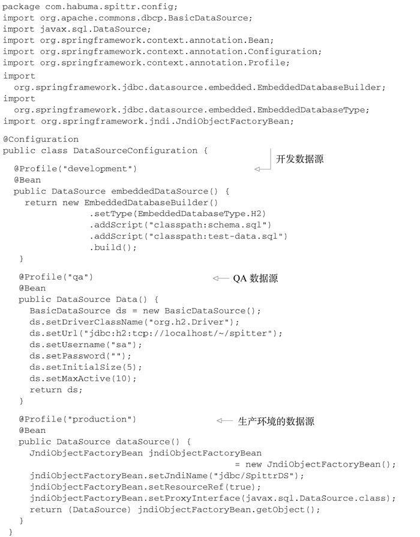
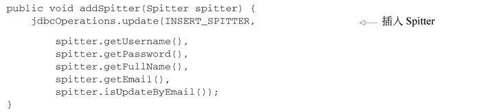
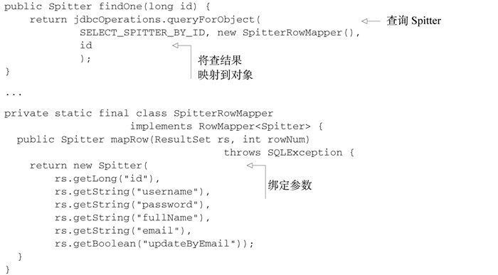
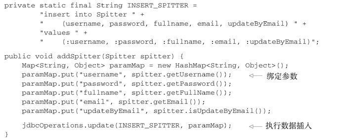

# 通过Spring和JDBC征服数据库

## 配置数据源

### 借助JndiObjectFactoryBean从JNDI中查找数据源DataSource

```java
@Bean
public JndiObjectFactoryBean dataSource() {
  JndiObjectFactoryBean jndiObjectFB = new JndiObjectFactoryBean();
  jndiObjectFB.setJndiName("jdbc/SpittrDS");
  jndiObjectFB.setResourceRef(true);
  jndiObjectFB.setProxyInterface(javax.sql.DataSource.class);
  return jndiObjectFB;
}
```

### 使用数据源连接池

```java
@Bean
  public BasicDataSource dataSource() {
  BasicDataSource ds = new BasicDataSource();
  ds.setDriverClassName("org.h2.Driver");
  ds.setUrl("jdbc:h2:tcp://localhost/~/spitter");
  ds.setUsername("sa");
  ds.setPassword("");
  ds.setInitialSize(5);
  ds.setMaxActive(10);
  return ds;
}
```
- 前四个属性是配置BasicDataSource所必需的。属性driverClassName指定了JDBC驱动类的全限定类名。在这里我们配置的是H2数据库的数据源。属性url用于设置数据库的JDBC URL。最后，username和password用于在连接数据库时进行认证。
- 以上四个基本属性定义了BasicDataSource的连接信息。除此以外，还有多个配置数据源连接池的属性。

池配置属性|所指定的内容
--|--
initialSize|池启动时创建的连接数量
maxActive|同一时间可从池中分配的最多连接数。如果设置为0，表示无限制
maxIdle|池里不会被释放的最多空闲连接数。如果设置为0，表示无限制
maxOpenPreparedStatements|在同一时间能够从语句池中分配的预处理语句（prepared statement）的最大数量。如果设置为0，表示无限制
maxWait|在抛出异常之前，池等待连接回收的最大时间（当没有可用连接时）。如果设置为-1，表示无限等待
minEvictableIdleTimeMillis|连接在池中保持空闲而不被回收的最大时间
minIdle|在不创建新连接的情况下，池中保持空闲的最小连接数
poolPreparedStatements|是否对预处理语句（prepared statement）进行池管理（布尔值）

### 基于JDBC驱动的数据源

在Spring中，通过JDBC驱动定义数据源是最简单的配置方式。Spring提供了三个这样的数据源类（均位于org.springframework.jdbc.datasource包中）供选择：
- DriverManagerDataSource：在每个连接请求时都会返回一个新建的连接。与DBCP的BasicDataSource不同，由DriverManagerDataSource提供的连接并没有进行池化管理；
- SimpleDriverDataSource：与DriverManagerDataSource的工作方式类似，但是它直接使用JDBC驱动，来解决在特定环境下的类加载问题，这样的环境包括OSGi容器；
- SingleConnectionDataSource：在每个连接请求时都会返回同一个的连接。尽管SingleConnectionDataSource不是严格意义上的连接池数据源，但是你可以将其视为只有一个连接的池。

配置DriverManagerDataSource的方法：

```java
@Bean
public DataSource dataSource() {
  DriverManagerDataSource ds = new DriverManagerDataSource();
  ds.setDriverClassName("org.h2.Driver");
  ds.setUrl("jdbc:h2:tcp://localhost/~/spitter");
  ds.setUsername("sa");
  ds.setPassword("");
  return ds;
}
```
- 与具备池功能的数据源相比，唯一的区别在于这些数据源bean都没有提供连接池功能，所以没有可配置的池相关的属性。
- 尽管这些数据源对于小应用或开发环境来说是不错的，但是要将其用于生产环境，你还是需要慎重考虑。因为SingleConnectionDataSource有且只有一个数据库连接，所以不适合用于多线程的应用程序，最好只在测试的时候使用。而DriverManagerDataSource和SimpleDriverDataSource尽管支持多线程，但是在每次请求连接的时候都会创建新连接，这是以性能为代价的。鉴于以上的这些限制，我强烈建议应该使用数据源连接池。

### 使用嵌入式的数据源

对于开发和测试来讲，嵌入式数据库都是很好的可选方案。这是因为每次重启应用或运行测试的时候，都能够重新填充测试数据。

使用jdbc命名空间来配置嵌入式的H2数据库，它会预先加载一组测试数据。

```java
@Bean
public DataSource dataSource() {
  return new EmbeddedDatabaseBuilder()
      .setType(EmbeddedDatabaseType.H2)
      .addScript("classpath:schema.sql")
      .addScript("classpath:test-data.sql")
      .build();
}
```
- schema.sql，包含了在数据库中创建表的SQL；
- test-data.sql，用来将测试数据填充到数据库中。

### 使用profile选择数据源

在某种环境下需要其中一种数据源，而在另外的环境中需要不同的数据源。借助Spring的profile特性能够在运行时选择数据源



- 当且仅当developmentprofile处于激活状态时，会创建嵌入式数据库，
- 当且仅当qa profile处于激活状态时，会创建DBCP BasicDataSource，
- 当且仅当productionprofile处于激活状态时，会从JNDI获取数据源。

数据源建立了与数据库的连接，接下来要实际访问数据库了。就像我在前面所提到的，Spring为我们提供了多种使用数据库的方式包括JDBC、Hibernate以及Java持久化API（Java Persistence API，JPA）

## 在Spring中使用JDBC

持久化技术有很多种，而Hibernate、iBATIS和JPA只是其中的几种而已。JDBC使用最古老的方式将Java对象保存到数据库中,JDBC不要求我们掌握其他框架的查询语言。它是建立在SQL之上的，而SQL本身就是数据访问语言。此外，与其他的技术相比，使用JDBC能够更好地对数据访问的性能进行调优。JDBC允许你使用数据库的所有特性，而这是其他框架不鼓励甚至禁止的。

再者，相对于持久层框架，JDBC能够让我们在更低的层次上处理数据，我们可以完全控制应用程序如何读取和管理数据，包括访问和管理数据库中单独的列。这种细粒度的数据访问方式在很多应用程序中是很方便的。例如在报表应用中，如果将数据组织为对象，而接下来唯一要做的就是将其解包为原始数据，那就没有太大意义了。

JDBC的不足之处：如果使用JDBC所提供的直接操作数据库的API，你需要负责处理与数据库访问相关的所有事情，其中包含管理数据库资源和处理异常。再提一句他的SQLException异常：你不但不清楚如何处理它（因为并不知道哪里出错了），而且你还要捕捉它两次！你需要在插入记录出错时捕捉它，同时你还需要在关闭语句和连接出错的时候捕捉它。

### 使用JDBC模板

Spring的JDBC框架承担了资源管理和异常处理的工作，从而简化了JDBC代码，让我们只需编写从数据库读写数据的必需代码。

Spring为JDBC提供了三个模板类供选择：
- JdbcTemplate：最基本的Spring JDBC模板，这个模板支持简单的JDBC数据库访问功能以及基于索引参数的查询；
- NamedParameterJdbcTemplate：使用该模板类执行查询时可以将值以命名参数的形式绑定到SQL中，而不是使用简单的索引参数；
- SimpleJdbcTemplate：该模板类利用Java 5的一些特性如自动装箱、泛型以及可变参数列表来简化JDBC模板的使用。

SimpleJdbcTemplate已经被废弃了，其Java 5的特性被转移到了JdbcTemplate中，并且只有在你需要使用命名参数的时候，才需要使用NamedParameterJdbcTemplate。这样的话，对于大多数的JDBC任务来说，JdbcTemplate就是最好的可选方案

在Spring中配置JdbcTemplate

```java
@Bean
public JdbcTemplate jdbcTemplate(DataSource dataSource) {
  return new JdbcTemplate(dataSource);
}
```
- dataSource在上一节被创建，生成JdbcTemplate时会自动注入

将jdbcTemplate装配到Repository中并使用它来访问数据库。

```java
@Repository
public class JdbcSpitterRepository implements SpitterRepository {
  private JdbcOperations jdbcOperations;
  @Inject
  public JdbcSpitterRepository(JdbcOperations jdbcOperations) {
    this.jdbcOperations = jdbcOperations;
  }
...
}
```
- @Repository注解，这表明它将会在组件扫描的时候自动创建。
- 它的构造器上使用了@Inject注解，因此在创建的时候，会自动获得一个JdbcOperations对象。
- JdbcOperations是一个接口，定义了JdbcTemplate所实现的操作。通过注入JdbcOperations，而不是具体的JdbcTemplate，能够保证JdbcSpitterRepository通过JdbcOperations接口达到与JdbcTemplate保持松耦合。

上面是自动装配，下面是显示配置的方法

```java
@Bean
public SpitterRepository spitterRepository(JdbcTemplate jdbcTemplate) {
  return new JdbcSpitterRepository(jdbcTemplate);
}
```

在Repository中具备可用的JdbcTemplate后，使用JdbcTemplate来插入数据




- 样板代码被巧妙地隐藏到JDBC模板类中了
- 当update()方法被调用的时候JdbcTemplate将会获取连接、创建语句并执行插入SQL。
- 也看不到对SQLException处理的代码。在内部，JdbcTemplate将会捕获所有可能抛出的SQLException，转换更明确的数据访问异常重新抛出。因为Spring的数据访问异常都是运行时异常，所以我们不必在addSpring()方法中进行捕获。

查询数据



- 使用了JdbcTemplate的回调，实现根据ID查询Spitter，并将结果集映射为Spitter对象。
- queryForObject()方法有三个参数：
  - String对象，包含了要从数据库中查找数据的SQL；
  - RowMapper对象，用来从ResultSet中提取数据并构建域对象（本例中为Spitter）；
  - 可变参数列表，列出了要绑定到查询上的索引参数值。

使用Lambda来表达RowMapper的实现，不必再使用具体的实现类

```java
public Spitter findOne(long id) {
  return jdbcOperations.queryForObject(
    SELECT_SPITTER_BY_ID,
    (rs, rowNum) -> {
      return new Spitter(
        rs.getLong("id"),
        rs.getString("username"),
        rs.getString("password"),
        rs.getString("fullName"),
        rs.getString("email"),
        rs.getBoolean("updateByEmail"));
    },
    id);
}
```
- Lambda表达式要比完整的RowMapper实现更为易读，不过它们的功能是相同的。

使用Java 8的方法引用，在单独的方法中定义映射逻辑

```java
public Spitter findOne(long id) {
  return jdbcOperations.queryForObject(
    SELECT_SPITTER_BY_ID, this::mapSpitter, id);
}
private Spitter mapSpitter(ResultSet rs, int row) throws SQLException {
    return new Spitter(
      rs.getLong("id"),
      rs.getString("username"),
      rs.getString("password"),
      rs.getString("fullName"),
      rs.getString("email"),
      rs.getBoolean("updateByEmail"));
}
```

### 使用命名参数

addSpitter()方法使用了索引参数。这意味着我们需要留意查询中参数的顺序，在将值传递给update()方法的时候要保持正确的顺序。如果在修改SQL时更改了参数的顺序，那我们还需要修改参数值的顺序。

除了这种方法之外，我们还可以使用命名参数。命名参数可以赋予SQL中的每个参数一个明确的名字，在绑定值到查询语句的时候就通过该名字来引用参数。

```java
private static final String SQL_INSERT_SPITTER =
      "insert into spitter (username, password, fullname) " +
      "values (:username, :password, :fullname)";
```
- 使用命名参数查询，绑定值的顺序就不重要了，我们可以按照名字来绑定值。

NamedParameterJdbcTemplate是一个特殊的JDBC模板类，它支持使用命名参数。在Spring中，NamedParameterJdbcTemplate的声明方式与常规的JdbcTemplate几乎完全相同

```java
@Bean
public NamedParameterJdbcTemplate jdbcTemplate(DataSource dataSource) {
  return new NamedParameterJdbcTemplate(dataSource);
}
```

将NamedParameterJdbcOperations（NamedParameterJdbcTemplate所实现的接口）注入到Repository中，用它来替代JdbcOperations。现在的addSpitter()方法如下所示：




