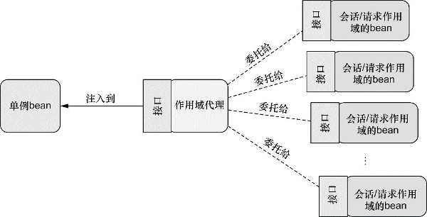

# 高级装配

深入介绍一些这样的高级技术。本章中所介绍的技术也许你不会天天都用到，但这并不意味着它们的价值会因此而降低。

## 1.环境与profile

针对不同环境选择不同配置

### 配置profile bean

`profiles/src/main/java/com/myapp/DataSourceConfig.java`

```java
package com.myapp;

import javax.sql.DataSource;

import org.springframework.context.annotation.Bean;
import org.springframework.context.annotation.Configuration;
import org.springframework.context.annotation.Profile;
import org.springframework.jdbc.datasource.embedded.EmbeddedDatabaseBuilder;
import org.springframework.jdbc.datasource.embedded.EmbeddedDatabaseType;
import org.springframework.jndi.JndiObjectFactoryBean;

@Configuration
public class DataSourceConfig {
  
  @Bean(destroyMethod = "shutdown")
  @Profile("dev")
  public DataSource embeddedDataSource() {
    return new EmbeddedDatabaseBuilder()
        .setType(EmbeddedDatabaseType.H2)
        .addScript("classpath:schema.sql")
        .addScript("classpath:test-data.sql")
        .build();
  }

  @Bean
  @Profile("prod")
  public DataSource jndiDataSource() {
    JndiObjectFactoryBean jndiObjectFactoryBean = new JndiObjectFactoryBean();
    jndiObjectFactoryBean.setJndiName("jdbc/myDS");
    jndiObjectFactoryBean.setResourceRef(true);
    jndiObjectFactoryBean.setProxyInterface(javax.sql.DataSource.class);
    return (DataSource) jndiObjectFactoryBean.getObject();
  }

}
```
- 使用@Profile注解指定某个bean属于哪一个profile。
- @Profile注解同样可以用在类级别上

```java
@Configuration
@Profile("dev")
public class DevelopmentProfileConfig {
}
```
```java
@Configuration
@Profile("prod")
public class ProductionProfileConfig {
}
```

### 激活profile

在Web应用的web.xml文件中设置默认的profile

`spring.profiles.active`

`spring.profiles.default`

使用profile进行测试

`profiles/src/test/java/profiles/DataSourceConfigTest.java`

```java
package profiles;

import static org.junit.Assert.*;

import java.sql.ResultSet;
import java.sql.SQLException;
import java.util.List;

import javax.sql.DataSource;

import org.junit.Test;
import org.junit.runner.RunWith;
import org.springframework.beans.factory.annotation.Autowired;
import org.springframework.jdbc.core.JdbcTemplate;
import org.springframework.jdbc.core.RowMapper;
import org.springframework.test.context.ActiveProfiles;
import org.springframework.test.context.ContextConfiguration;
import org.springframework.test.context.junit4.SpringJUnit4ClassRunner;

import com.myapp.DataSourceConfig;

public class DataSourceConfigTest {

  @RunWith(SpringJUnit4ClassRunner.class)
  @ContextConfiguration(classes=DataSourceConfig.class)
  @ActiveProfiles("dev")
  public static class DevDataSourceTest {
    @Autowired
    private DataSource dataSource;
    
    @Test
    public void shouldBeEmbeddedDatasource() {
      assertNotNull(dataSource);
      JdbcTemplate jdbc = new JdbcTemplate(dataSource);
      List<String> results = jdbc.query("select id, name from Things", new RowMapper<String>() {
        @Override
        public String mapRow(ResultSet rs, int rowNum) throws SQLException {
          return rs.getLong("id") + ":" + rs.getString("name");
        }
      });
      
      assertEquals(1, results.size());
      assertEquals("1:A", results.get(0));
    }
  }

  @RunWith(SpringJUnit4ClassRunner.class)
  @ContextConfiguration(classes=DataSourceConfig.class)
  @ActiveProfiles("prod")
  public static class ProductionDataSourceTest {
    @Autowired
    private DataSource dataSource;
    
    @Test
    public void shouldBeEmbeddedDatasource() {
      // should be null, because there isn't a datasource configured in JNDI
      assertNull(dataSource);
    }
  }
  
  @RunWith(SpringJUnit4ClassRunner.class)
  @ContextConfiguration("classpath:datasource-config.xml")
  @ActiveProfiles("dev")
  public static class DevDataSourceTest_XMLConfig {
    @Autowired
    private DataSource dataSource;
    
    @Test
    public void shouldBeEmbeddedDatasource() {
      assertNotNull(dataSource);
      JdbcTemplate jdbc = new JdbcTemplate(dataSource);
      List<String> results = jdbc.query("select id, name from Things", new RowMapper<String>() {
        @Override
        public String mapRow(ResultSet rs, int rowNum) throws SQLException {
          return rs.getLong("id") + ":" + rs.getString("name");
        }
      });
      
      assertEquals(1, results.size());
      assertEquals("1:A", results.get(0));
    }
  }

  @RunWith(SpringJUnit4ClassRunner.class)
  @ContextConfiguration("classpath:datasource-config.xml")
  @ActiveProfiles("prod")
  public static class ProductionDataSourceTest_XMLConfig {
    @Autowired(required=false)
    private DataSource dataSource;
    
    @Test
    public void shouldBeEmbeddedDatasource() {
      // should be null, because there isn't a datasource configured in JNDI
      assertNull(dataSource);
    }
  }

}
```
- 使用@ActiveProfiles激活不同环境的profile

## 2.条件化的bean

假设你希望一个或多个bean只有在应用的类路径下包含特定的库时才创建。或者我们希望某个bean只有当另外某个特定的bean也声明了之后才会创建。我们还可能要求只有某个特定的环境变量设置之后，才会创建某个bean。

Spring 4引入了一个新的@Conditional注解，它可以用到带有@Bean注解的方法上。如果给定的条件计算结果为true，就会创建这个bean，否则的话，这个bean会被忽略。

假设有一个名为MagicBean的类，我们希望只有设置了magic环境属性的时候，Spring才会实例化这个类。如果环境中没有这个属性，那么MagicBean将会被忽略。

`conditional/src/main/java/com/habuma/restfun/MagicBean.java`

```java
package com.habuma.restfun;

public class MagicBean {

}
```

`conditional/src/main/java/com/habuma/restfun/MagicExistsCondition.java`

```java
package com.habuma.restfun;

import org.springframework.context.annotation.Condition;
import org.springframework.context.annotation.ConditionContext;
import org.springframework.core.env.Environment;
import org.springframework.core.type.AnnotatedTypeMetadata;

public class MagicExistsCondition implements Condition {

  @Override
  public boolean matches(ConditionContext context, AnnotatedTypeMetadata metadata) {
    Environment env = context.getEnvironment();
    return env.containsProperty("magic");
  }
  
}
```
- 在上面的程序清单中，matches()方法很简单但功能强大。它通过给定的ConditionContext对象进而得到Environment对象，并使用这个对象检查环境中是否存在名为magic的环境属性。在本例中，属性的值是什么无所谓，只要属性存在即可满足要求。如果满足这个条件的话，matches()方法就会返回true。所带来的结果就是条件能够得到满足，所有@Conditional注解上引用MagicExistsCondition的bean都会被创建。

`conditional/src/main/java/com/habuma/restfun/MagicConfig.java`

```java
package com.habuma.restfun;

import org.springframework.context.annotation.Bean;
import org.springframework.context.annotation.Conditional;
import org.springframework.context.annotation.Configuration;

@Configuration
public class MagicConfig {

  @Bean
  @Conditional(MagicExistsCondition.class)
  public MagicBean magicBean() {
    return new MagicBean();
  }
  
}
```
- @Conditional中给定了一个Class，它指明了条件，在本例中，也就是MagicExistsCondition

流程整理：

1. 创建MagicExistsCondition继承于Condition接口
2. 重写MagicExistsCondition中的matches方法，使用ConditionContext和AnnotatedTypeMetadata，检查上下文中的数据是否满足要求(包含特定的库，声明特定的bean，或者存在特定的环境变量)
3. 在要生成的bean上添加条件注解并指定条件计算类 `@Conditional(MagicExistsCondition.class)`
4. 如果条件满足，则生成被注解的类，完成根据条件判断控制bean的生成。

可用于检查的数据：
- ConditionContext
  - 借助getRegistry()返回的BeanDefinitionRegistry检查bean定义；
  - 借助getBeanFactory()返回的ConfigurableListableBeanFactory检查bean是否存在，甚至探查bean的属性；
  - 借助getEnvironment()返回的Environment检查环境变量是否存在以及它的值是什么；
  - 读取并探查getResourceLoader()返回的ResourceLoader所加载的资源；
  - 借助getClassLoader()返回的ClassLoader加载并检查类是否存在。
- AnnotatedTypeMetadata则能够让我们检查带有@Bean注解的方法上还有什么其他的注解。

## 3.处理自动装配的歧义性

仅有一个bean匹配所需的结果时，自动装配才是有效的。如果不仅有一个bean能够匹配结果或没有bean匹配的话，这种歧义性会阻碍Spring自动装配属性、构造器参数或方法参数。

先构造一个歧义的情况

```java
@Autowired
public void setDessert(Dessert dessert) {
    this.dessert = dessert;
}

@Component
public class Cake implements Dessert { ... }
@Component
public class Cookies implements Dessert { ... }
@Component
public class IceCream implements Dessert { ... }
```
- 这三个实现均使用了@Component注解，在组件扫描的时候，能够发现它们并将其创建为Spring应用上下文里面的bean。然后，当Spring试图自动装配setDessert()中的Dessert参数时，它并没有唯一、无歧义的可选值。
- Spring会抛出NoUniqueBeanDefinitionException

解决方案

1 标示首选的bean

```java
@Component
@Primary
public class IceCream implements Dessert { ... }
```

2 限定自动装配的bean

```java
@Autowired
@Qualifier("iceCream")
public void setDessert(Dessert dessert) {
    this.dessert = dessert;
}
```
- 这里的"iceCream"为bean的id，默认为返回bean的类的首字母小写。

3 创建自定义的限定符，限定自动装配的bean

```java
@Component
@Qualifier("cold")
public class IceCream implements Dessert { ... }
```
- 在这里所需要做的就是在bean声明上添加@Qualifier注解。
```java
@Bean
@Qualifier("cold")
public Dessert iceCream() {
    return new IceCream();
}
```
- 当通过Java配置显式定义bean的时候，@Qualifier也可以与@Bean注解一起使用
```java
@Autowired
@Qualifier("cold")
public void setDessert(Dessert dessert) {
    this.dessert = dessert;
}
```
- 限定自定义限定符的bean

## 4.bean的作用域

在默认情况下，Spring应用上下文中所有bean都是作为以单例（singleton）的形式创建的。也就是说，不管给定的一个bean被注入到其他bean多少次，每次所注入的都是同一个实例。在大多数情况下，单例bean是很理想的方案。有时候，可能会发现，你所使用的类是易变的（mutable），它们会保持一些状态，因此重用是不安全的。在这种情况下，将class声明为单例的bean就不是什么好主意了，因为对象会被污染，稍后重用的时候会出现意想不到的问题。

Spring定义了多种作用域，可以基于这些作用域创建bean，包括：
- 单例（Singleton）：在整个应用中，只创建bean的一个实例。默认
- 原型（Prototype）：每次注入或者通过Spring应用上下文获取的时候，都会创建一个新的bean实例。
- 会话（Session）：在Web应用中，为每个会话创建一个bean实例。
- 请求（Rquest）：在Web应用中，为每个请求创建一个bean实例。

自动装配的情况

```java
@Component
@Scope(ConfigurableBeanFactory.SCOPE_PROTOTYPE)
public class Notepad { ... }
// 使用@Scope("prototype")也可以，但不推荐
```

java可视化配置情况

```java
@Bean
@Scope(ConfigurableBeanFactory.SCOPE_PROTOTYPE)
public Notepad notepad() {
  return new Notepad();
}
```

使用会话和请求作用域

就电商web购物车的bean来说，会话作用域是最为合适的，因为它与给定的用户关联性最大。要指定会话作用域，我们可以使用@Scope注解，它的使用方式与指定原型作用域是相同的

```java
@Component
@Scope(
    value=WebApplicationContext.SCOPE_SESSION,
    proxyMode=ScopedProxyMode.INTERFACES)
public ShoppingCart cart() { ... }
```
- 将value设置成了WebApplicationContext中的SCOPE_SESSION常量（它的值是session）。这会告诉Spring为Web应用中的每个会话创建一个ShoppingCart。
- 同时还有一个proxyMode属性，它被设置成了ScopedProxyMode.INTERFACES。这个属性解决了将会话或请求作用域的bean注入到单例bean中所遇到的问题。如果有一个单例范围的bean依赖与ShoppingCart，但二者的作用域是不同的，而且创建这个单例bean时ShoppingCart bean还没创建，并且不能直接注入依赖，此时会将单例的依赖ShoppingCart作为接口注入，即ScopedProxyMode.INTERFACES所设置的内容。




## 5.运行时值注入

当讨论依赖注入的时候，我们通常所讨论的是将一个bean引用注入到另一个bean的属性或构造器参数中。它通常来讲指的是将一个对象与另一个对象进行关联。但是bean装配的另外一个方面指的是将一个值注入到bean的属性或者构造器参数中。

```java
@Bean
public CompactDisc sgtPeppers() {
  return new BlankDisc(
      "Sgt. Pepper's Lonely Hearts Club Band",
      "The Beatles");
}
```
- 有时候硬编码是可以的，但有的时候，我们可能会希望避免硬编码值，而是想让这些值在运行时再确定。为了实现这些功能，Spring提供了两种在运行时求值的方式：
  - 属性占位符（Property placeholder）。
  - Spring表达式语言（SpEL）。

### 注入外部的值

`externals/src/test/java/com/soundsystem/EnvironmentConfig.java`

```java
package com.soundsystem;

import org.springframework.beans.factory.annotation.Autowired;
import org.springframework.context.annotation.Bean;
import org.springframework.context.annotation.Configuration;
import org.springframework.context.annotation.PropertySource;
import org.springframework.core.env.Environment;

@Configuration
@PropertySource("classpath:/com/soundsystem/app.properties")
public class EnvironmentConfig {

  @Autowired
  Environment env;
  
  @Bean
  public BlankDisc blankDisc() {
    return new BlankDisc(
        env.getProperty("disc.title"),
        env.getProperty("disc.artist"));
  }
  
}
```
- @PropertySource引用了类路径中一个名为app.properties的文件

`externals/src/main/resources/com/soundsystem/app.properties`

```properties
disc.title=Sgt. Peppers Lonely Hearts Club Band
disc.artist=The Beatles
```

这里在回头看下Environment，它的getProperty()方法有四个重载的变种形式

- String getProperty(String key)，返回String类型的值
- String getProperty(String key, String defaultValue)，指定属性不存在的时候，会使用一个默认值
- T getProperty(String key, Class<T> type)，类型转换，`env.getProperty("db.connection.count", Integer.class, 30);`
- T getProperty(String key, Class<T> type, T defaultValue)
- 其他相关方法
  - 检查一下某个属性是否存在，`boolean titleExists = env.containsProperty("disc.title");`
  - 将属性解析为类，`Class<CompactDisc> cdClass =
    env.getPropertyAsClass("disc.class", CompactDisc.class);`
  - String[] getActiveProfiles()：返回激活profile名称的数组；
  - String[] getDefaultProfiles()：返回默认profile名称的数组；
  - boolean acceptsProfiles(String... profiles)：如果environment支持给定profile的话，就返回true。

使用占位符插入属性

先配置一个bean才能使用占位符

```java
@Bean
public
static PropertySourcesPlaceholderConfigurer placeholderConfigurer() {
  return new PropertySourcesPlaceholderConfigurer();
}
```

使用占位符

```java
public BlankDisc(
      @Value("${disc.title}") String title,
      @Value("${disc.artist}") String artist) {
  this.title = title;
  this.artist = artist;
}
```

### 使用Spring表达式语言进行装配

Spring 3引入了Spring表达式语言（Spring Expression Language，SpEL），它能够以一种强大和简洁的方式将值装配到bean属性和构造器参数中，在这个过程中所使用的表达式会在运行时计算得到值。

SpEL拥有很多特性，包括：
- 使用bean的ID来引用bean；
- 调用方法和访问对象的属性；
- 对值进行算术、关系和逻辑运算；
- 正则表达式匹配；
- 集合操作。

SpEL表达式要放到“#{ ... }”之中，这与属性占位符有些类似，属性占位符需要放到“${ ... }”之中。

```java
#{1}
// 这个表达式的计算结果就是数字1
#{T(System).currentTimeMillis()}
// 它的最终结果是计算表达式的那一刻当前时间的毫秒数。
#{sgtPeppers.artist}
// 会计算得到ID为sgtPeppers的bean的artist属性
#{systemProperties['disc.title']}
// 通过systemProperties对象引用系统属性
@Value("#{systemProperties['disc.title']}") String title
// 从系统属性中获取字段
#{sgtPeppers}
// 通过ID引用其他的bean
#{sgtPeppers.artist}
// 在一个表达式中引用sgtPeppers的artist属性
#{artistSelector.selectArtist()}
// 调用bean的selectArtist()方法
#{artistSelector.selectArtist().toUpperCase()}
// 将selectArtist()的返回值改为大写
#{artistSelector.selectArtist()?.toUpperCase()}
// 使用了"?."运算符。这个运算符能够在访问它右边的内容之前，确保它所对应的元素不是null。
// 所以，如果selectArtist()的返回值是null的话，那么SpEL将不会调用toUpperCase()方法。表达式的返回值会是null。
#{T(java.lang.Math).PI}
#{T(java.lang.Math).random()}
// 在SpEL中访问类作用域的方法和常量，要依赖T()运算符
```


