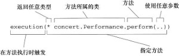
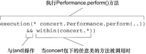
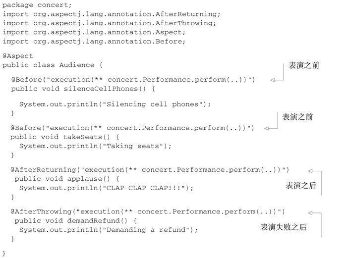
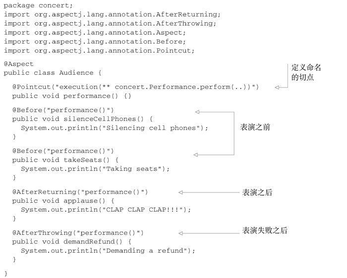
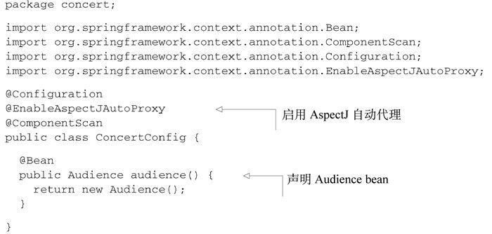
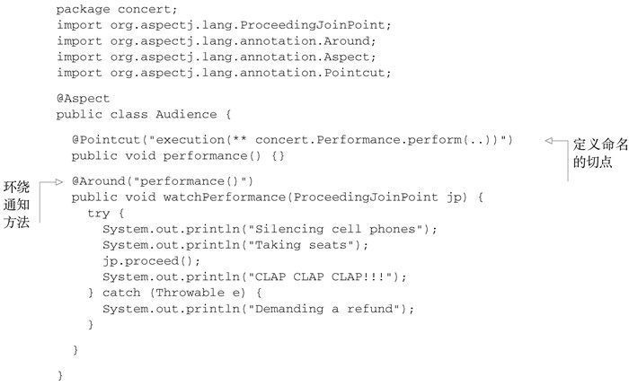
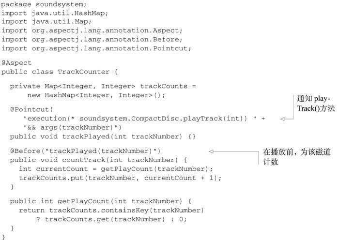
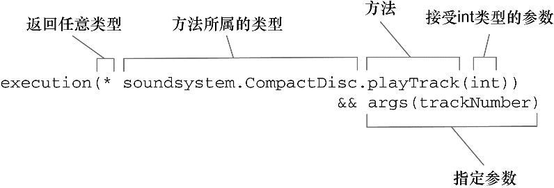
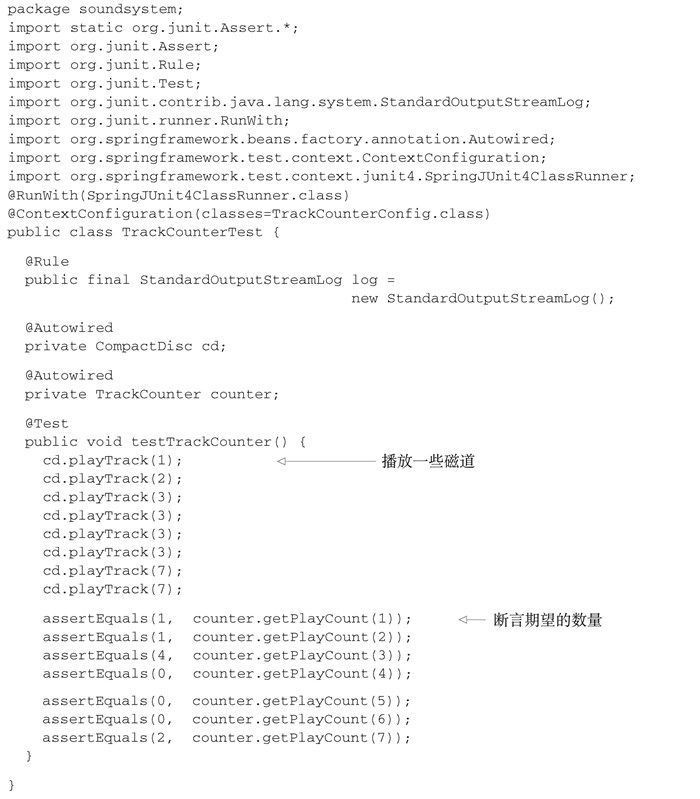
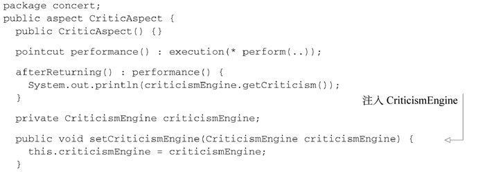

# 面向切面的Spring

多个业务模块普遍需要的处理逻辑，如日志，安全，缓存，声明事务。使用aop可以在完成业务逻辑时被动完成其他需要的逻辑，提高效率。

## 1.基本原理

描述切面的常用术语：
- 通知（advice）：表示切面要完成的工作，比如记录日志，增加缓存，认证权限等。它有五种类型。
  - 前置通知（Before）：在目标方法被调用之前调用通知功能；
  - 后置通知（After）：在目标方法完成之后调用通知，此时不会关心方法的输出是什么；
  - 返回通知（After-returning）：在目标方法成功执行之后调用通知；
  - 异常通知（After-throwing）：在目标方法抛出异常后调用通知；
  - 环绕通知（Around）：通知包裹了被通知的方法，在被通知的方法调用之前和调用之后执行自定义的行为。
- 切面（Aspect）：是通知和切点的结合。
  - 通知（advice）：具体功能。
  - 切点（pointcut）：在何处完成其功能。
- 连接点（join point）：在何时完成其功能。
- 引入（Introduction）：引入允许我们向现有的类添加新方法或属性。
- 织入（Weaving）：把切面应用到目标对象并创建新的代理对象的过程。在目标对象的生命周期里有多个点可以进行织入：
  - 编译期：切面在目标类编译时被织入。这种方式需要特殊的编译器。AspectJ的织入编译器就是以这种方式织入切面的。
  - 类加载期：切面在目标类加载到JVM时被织入。这种方式需要特殊的类加载器（ClassLoader），它可以在目标类被引入应用之前增强该目标类的字节码。AspectJ 5的加载时织入（load-time weaving，LTW）就支持以这种方式织入切面。
  - 运行期：切面在应用运行的某个时刻被织入。一般情况下，在织入切面时，AOP容器会为目标对象动态地创建一个代理对象。Spring AOP就是以这种方式织入切面的。

Spring提供了4种类型的AOP支持：

- 基于代理的经典Spring AOP；
- 纯POJO切面；
- @AspectJ注解驱动的切面；
- 注入式AspectJ切面（适用于Spring各版本）。

## 2.定义切点

```java
package concert;

public interface Performance {
  public void perform();
}
```

在切面中添加切点

- 为Performance的perform()方法添加切点


- 为concert包中的Performance的perform()方法。可用and or not 和 && || !


>最后的反括号多余

- 使用id指定bean为切点

```java
execution(* concert.Performance.perform())
        and bean('woodstock')
```


## 3.使用注解创建切面

### 定义切面


- 使用AspectJ注解并赋切点，从而定义连接点

注解|通知
--|--
@After|通知方法会在目标方法返回或抛出异常后调用
@AfterReturning|通知方法会在目标方法返回后调用
@AfterThrowing|通知方法会在目标方法抛出异常后调用
@Around|通知方法会将目标方法封装起来
@Before|通知方法会在目标方法调用之前执行

### 通过@Pointcut注解声明频繁使用的切点表达式



### java显示装配

创建的切面没有组件注解，不会被自动添加bean，就算使用传统显示装配也并不会被视为一个切面，需要在JavaConfig中启用AspectJ注解的自动代理



```java
@Bean
public Audience audience() {
    return new Audience();
}
```

### 创建环绕通知

创建切面同时添加前置通知和后置通知



- @Around注解与其他注解的不同之处在于接收ProceedingJoinPoint参数，并调用其proceed()方法。但也可以不调用或调用多次，实现不同的效果。

### 处理通知中的参数



切点表达式改动



### 测试



### 通过注解引入新功能

为示例中的所有的Performance实现引入下面的Encoreable接口

```java
package concert;

public interface Encoreable {
    void performEncore();
}
```

创建一个新的切面

```java
package concert;

import org.aspectj.lang.annotation.Aspect;
import org.aspectj.lang.annotation.DeclareParents;

@Aspect
public class EncoreableIntroducer {

  @DeclareParents(value="concert.Performance+",
                  defaultImpl=DefaultEncoreable.class)
  public static Encoreable encoreable;

}
```
- EncoreableIntroducer是一个切面。但是，它与我们之前所创建的切面不同，它并没有提供前置、后置或环绕通知，而是通过@DeclareParents注解，将Encoreable接口引入到Performance bean中。

@DeclareParents注解由三部分组成：

- value属性指定了哪种类型的bean要引入该接口。在本例中，也就是所有实现Performance的类型。（标记符后面的加号表示是Performance的所有子类型，而不是Performance本身。）
- defaultImpl属性指定了为引入功能提供实现的类。在这里，我们指定的是DefaultEncoreable提供实现。
- @DeclareParents注解所标注的静态属性指明了要引入了接口。在这里，我们所引入的是Encoreable接口。

在Spring应用中将EncoreableIntroducer声明为一个bean

```xml
<bean class="concert.EncoreableIntroducer" />
```

Spring的自动代理机制将会获取到它的声明，当Spring发现一个bean使用了@Aspect注解时，Spring就会创建一个代理，然后将调用委托给被代理的bean或被引入的实现，这取决于调用的方法属于被代理的bean还是属于被引入的接口。

使用注解配置的缺点是必须修改或重写切面代码，如果维护已有的非业务模块代码，如日志和安全认证等，需要在Spring XML配置文件中声明切面。这里偷个懒。

## 4.为AspectJ切面注入依赖

Spring AOP 是一个功能比较弱的AOP解决方案，AspectJ提供了Spring AOP所不能支持的许多类型的切点。如在创建对象时应用通知的构造器切点

对于大部分功能来讲，AspectJ切面与Spring是相互独立的。但是精心设计且有意义的切面很可能依赖其他类来完成它们的工作，这时可以借助Spring的依赖注入把bean装配进AspectJ切面中。

创建一个新切面



CriticAspect的主要职责是在表演结束后为表演发表评论。performance()切点匹配perform()方法。当它与afterReturning()通知一起配合使用时，我们可以让该切面在表演结束时起作用。实际上，CriticAspect与一个CriticismEngine对象相协作,为了避免CriticAspect和CriticismEngine之间产生不必要的耦合，我们通过Setter依赖注入为CriticAspect设置CriticismEngine。

要注入到CriticAspect中的CriticismEngine实现

```java
package com.springinaction.springidol;
public class CriticismEngineImpl implements CriticismEngine {
  public CriticismEngineImpl() {}

  public String getCriticism() {
    int i = (int) (Math.random() * criticismPool.length);
    return criticismPool[i];
  }

  // injected
  private String[] criticismPool;
  public void setCriticismPool(String[] criticismPool) {
    this.criticismPool = criticismPool;
  }
}
```

使用XML声明为一个Spring bean

>为什么不用自动装配？
>可能因为AspectJ不支持自动装配，所以使用xml

```xml
<bean id="criticismEngine"
    class="com.springinaction.springidol.CriticismEngineImpl">
  <property name="criticisms">
    <list>
      <value>Worst performance ever!</value>
      <value>I laughed, I cried, then I realized I was at the
             wrong show.</value>
      <value>A must see show!</value>
    </list>
  </property>
</bean>
```

把criticismEnginebean注入到CriticAspect中

```xml
<bean class="com.springinaction.springidol.CriticAspect"
    factory-method="aspectOf">
  <property name="criticismEngine" ref="criticismEngine" />
</bean>
```

- Spring不能像之前那样使用<bean>声明来创建一个CriticAspect实例——它已经在运行时由AspectJ创建完成了。Spring需要通过aspectOf()工厂方法获得切面的引用，然后像<bean>元素规定的那样在该对象上执行依赖注入。

