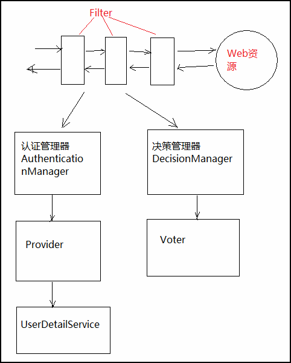

# 权限控制

使用spring security实现权限的动态可配

在本示例中，有以下几个页面，区分不同的权限：

- 首页 所有人都可以访问
- 登录页 所有人可都可以访问
- 欢迎页 登录后的用户都可以访问
- 管理页 只有管理员可访问
- 无权限提醒页 当一个用户的访问没有权限时，跳转到该页

## Spring Security认证架构
总的来说，Spring Security通过filter来控制web应用的安全，但filter自己不干事，分别委托给了认证管理器和决策管理器，认证管理器和决策管理器再分别委托给Provider和Voter，就这样一级级委托下来，委托的最底层就是需要我们根据实际情况实现的逻辑。



## 基本实现方法

### 建立用户对象

```java
public class User implements UserDetails{
    private String username;
    private String password;
    private String role;
}
```

### 用户登录数据层

```java
public class userMap {
    
    @Override
    public User getUser(String username) {
        // 从数据库中查询用户
        return userMap.get(username);
    }
}
```

### 用户登陆服务层

```java
public class CustomUserDetailsService implements UserDetailsService {

@Override
    public UserDetails loadUserByUsername(String s) throws UsernameNotFoundException {
        User user = userMap.getUser(s);
        if (user == null) {
            throw new UsernameNotFoundException("用户名不对");
        }
        return user;
        // 如果User未继承userdetails
        List<SimpleGrantedAuthority> authorities = new ArrayList<SimpleGrantedAuthority>();
        authorities.add(new SimpleGrantedAuthority("ROLE_" + user.getRole()));
        return new org.springframework.security.core.userdetails.User(user.getUsername(), user.getPassword(),
                authorities);
    }
}
```

### 配置Security

```java
@Configuration
@EnableWebSecurity
@EnableGlobalMethodSecurity(prePostEnabled = true)
public class SecurityConf extends WebSecurityConfigurerAdapter {
    @Bean
    public UserDetailsService userDetailsService() {
        return new CustomUserDetailsService();
    }
    @Override
    protected void configure(AuthenticationManagerBuilder auth) throws Exception {
        auth.userDetailsService(userDetailsService());
    }
    @Override
    protected void configure(HttpSecurity http) throws Exception {
        http
                .authorizeRequests()
                .antMatchers("/", "/index")
                .permitAll()
                .anyRequest()
                .authenticated()
                .and()
                .formLogin()
                .loginPage("/login")
                .defaultSuccessUrl("/user-page")
                .permitAll()
                .and()
                .logout()
                .permitAll();
    }
}
```
- `EnableGlobalMethodSecurity`注解使用后，代码中可以使用`@PreAuthorize`注解来验证用户权限

### 添加角色权限验证

```java
@RequestMapping(value = "/user", method = RequestMethod.GET)
@PreAuthorize("hasAnyRole('admin', 'user')")
public String userPage() {
    return "user-page";
}
@RequestMapping(value = "/admin", method = RequestMethod.GET)
@PreAuthorize("hasAnyRole('admin')")
public String adminPage() {
    return "admin-page";
}
```

### 为403权限错误添加重定向页面

#### 控制器

```java
@Controller
public class UserController {
    @RequestMapping(value = { "", "/index" }, method = RequestMethod.GET)
    public String home() {
        return "index";
    }
    @RequestMapping(value = "/user-page", method = RequestMethod.GET)
    public String userPage() {
        return "user-page";
    }
    @RequestMapping(value = "/admin-page", method = RequestMethod.GET)
    public String adminPage() {
        return "admin-page";
    }
    @RequestMapping(value = "/login", method = RequestMethod.GET)
    public String login() {
        return "login";
    }
    @RequestMapping("/403")
    public String forbidden() {
        return "403";
    }
}
```

#### 配置

```java
@Configuration
public class WebAppConf extends WebMvcConfigurerAdapter {
    @Bean
    public EmbeddedServletContainerCustomizer containerCustomizer() {
        return new EmbeddedServletContainerCustomizer() {
            @Override
            public void customize(ConfigurableEmbeddedServletContainer container) {
                ErrorPage error403Page = new ErrorPage(HttpStatus.FORBIDDEN, "/403");
                container.addErrorPages(error403Page);
            }
        };
    }
}
```

## 使用PasswordEncoder对用户密码加密

上一节中用户的密码都是以明文保存的，这样不安全。在本节中我们将实现对用户的密码进行加密。

org.springframework.security.crypto.password.PasswordEncoder，是spring当前推荐使用的接口。

实现类只有三个，简单明了，但加密安全性却提高了。

- NoOpPasswordEncoder不多说了，啥也不做按原文本处理，相当于不加密。
- StandardPasswordEncoder 1024次迭代的SHA-256散列哈希加密实现，并使用一个随机8字节的salt。
- BCryptPasswordEncoder 使用BCrypt的强散列哈希加密实现，并可以由客户端指定加密的强度strength，强度越高安全性自然就越高，默认为10.

>在Spring的注释中，明确写明了如果是开发一个新的项目，BCryptPasswordEncoder是较好的选择。

```java
@Override
protected void configure(AuthenticationManagerBuilder auth) throws Exception {
    auth.userDetailsService(CustomUserDetailsService)
            .passwordEncoder(new BCryptPasswordEncoder());
}
```


## 自定义决策管理器(动态权限码)

### 权限资源 SecurityMetadataSource

实现SecurityMetadataSource，来从配置文件或数据库中加载访问资源时所需要的具体权限。SecurityMetadataSource是一个接口，同时还有一个接口FilterInvocationSecurityMetadataSource继承于它，但FilterInvocationSecurityMetadataSource只是一个标识接口，对应于FilterInvocation，本身并无任何内容。因为我们做的一般都是web项目，所以实际需要实现的接口是FilterInvocationSecurityMetadataSource，这是因为Spring Security中很多web才使用的类参数类型都是FilterInvocationSecurityMetadataSource。

下面是一个自定义实现类CustomSecurityMetadataSource的示例代码，它的主要责任就是当访问一个url时返回这个url所需要的访问权限。

```java
public class CustomSecurityMetadataSource implements FilterInvocationSecurityMetadataSource {
    public Collection<ConfigAttribute> getAttributes(Object object) throws IllegalArgumentException {
        FilterInvocation fi = (FilterInvocation) object;
        Map<String, Collection<ConfigAttribute>> metadataSource = CustomSecurityContext.getMetadataSource();
        for (Map.Entry<String, Collection<ConfigAttribute>> entry : metadataSource.entrySet()) {
            String uri = entry.getKey();
            RequestMatcher requestMatcher = new AntPathRequestMatcher(uri);
            if (requestMatcher.matches(fi.getHttpRequest())) {
                return entry.getValue();
            }
        }
        return null;
    }
    public Collection<ConfigAttribute> getAllConfigAttributes() {
        return null;
    }
    public boolean supports(Class<?> clazz) {
        return FilterInvocation.class.isAssignableFrom(clazz);
    }
}
```

- getAttributes方法返回本次访问需要的权限，可以有多个权限。在上面的实现中如果没有匹配的url直接返回null，也就是没有配置权限的url默认都为白名单，想要换成默认是黑名单只要修改这里即可。
- getAllConfigAttributes方法如果返回了所有定义的权限资源，Spring Security会在启动时校验每个ConfigAttribute是否配置正确，不需要校验直接返回null。
- supports方法返回类对象是否支持校验，web项目一般使用FilterInvocation来判断，或者直接返回true。

配置文件

```properties
user=/user
admin=/admin
```
- 感觉写反了

配置文件加载代码

```java
ResourcePatternResolver resourcePatternResolver = new PathMatchingResourcePatternResolver();
Resource[] resources = resourcePatternResolver.getResources("classpath*:/security/*.properties");
if (ArrayUtils.isEmpty(resources)) {
    return;
}
Properties properties = new Properties();
for (Resource resource : resources) {
    properties.load(resource.getInputStream());
}
for (Map.Entry<Object, Object> entry : properties.entrySet()) {
    String key = (String) entry.getKey();
    String value = (String) entry.getValue();
    String[] values = StringUtils.split(value, ",");
    Collection<ConfigAttribute> configAttributes = new ArrayList<ConfigAttribute>();
    ConfigAttribute configAttribute = new SecurityConfig(key);
    configAttributes.add(configAttribute);
    for (String v : values) {
        METADATA_SOURCE_MAP.put(StringUtils.trim(v), configAttributes);
    }
}

```
- 可以看出配置文件中同一资源需要的多个权限用逗号隔开
- 这里的url是key，value是访问需要的权限码，一个权限码可以对应多个url，一个url也可以有多个权限码

#### 从数据库中读取

```java
@Override
    public Collection<ConfigAttribute> getAttributes(Object o) {
        String requestUrl = ((FilterInvocation) o).getRequestUrl();
        List<Menu> allMenu = menuService.getAllMenu();
        for (Menu menu : allMenu) {
            if (antPathMatcher.match(menu.getUrl(), requestUrl)
                    &&menu.getRoles().size()>0) {
                List<Role> roles = menu.getRoles();
                int size = roles.size();
                String[] values = new String[size];
                for (int i = 0; i < size; i++) {
                    values[i] = roles.get(i).getName();
                }
                return SecurityConfig.createList(values);
            }
        }
        //没有匹配上的资源，都是登录访问
        return SecurityConfig.createList("ROLE_LOGIN");
    }
```

### 权限决策 AccessDecisionManager

有了权限资源，知道了当前访问的url需要的具体权限，接下来就是决策当前的访问是否能通过权限验证了。这需要通过实现自定义的AccessDecisionManager来实现。

```java
public class CustomAccessDecisionManager implements AccessDecisionManager {
    public void decide(Authentication authentication, Object object, Collection<ConfigAttribute> configAttributes) throws AccessDeniedException, InsufficientAuthenticationException {
        Iterator<ConfigAttribute> iterator = configAttributes.iterator();
        while (iterator.hasNext()) {
            if (authentication == null) {
                throw new AccessDeniedException("当前访问没有权限");
            }
            ConfigAttribute configAttribute = iterator.next();
            String needCode = configAttribute.getAttribute();
            Collection<? extends GrantedAuthority> authorities = authentication.getAuthorities();
            for (GrantedAuthority authority : authorities) {
                if (StringUtils.equals(authority.getAuthority(), "ROLE_" + needCode)) {
                    return;
                }
            }
        }
        throw new AccessDeniedException("当前访问没有权限");
    }
    public boolean supports(ConfigAttribute attribute) {
        return true;
    }
    public boolean supports(Class<?> clazz) {
        return FilterInvocation.class.isAssignableFrom(clazz);
    }
}
```

- 同样的也有三个方法，其它两个和SecurityMetadataSource类似，这里主要讲讲decide方法。
- decide方法的三个参数中：
  - authentication包含了当前的用户信息，包括拥有的权限。这里的权限来源就是前面登录时UserDetailsService中设置的authorities。
  - object就是FilterInvocation对象，可以得到request等web资源。
  - configAttributes是本次访问需要的权限。

### 配置使用自定义实现类

```java
@Autowired
FilterInvocationSecurityMetadataSource securityMetadataSource;
@Autowired
AccessDecisionManager accessDecisionManager;

protected void configure(HttpSecurity http) throws Exception {
    http.authorizeRequests().anyRequest().authenticated()
        .withObjectPostProcessor(new ObjectPostProcessor<FilterSecurityInterceptor>() {
            @Override
            public <O extends FilterSecurityInterceptor> O postProcess(O fsi) {
                fsi.setAccessDecisionManager(accessDecisionManager());
                fsi.setSecurityMetadataSource(securityMetadataSource());
                return fsi;
                }
        });
}
```


参考链接

- https://www.ktanx.com/blog/p/4600
- https://www.ktanx.com/blog/p/4916
- https://www.ktanx.com/blog/p/4917
- https://www.ktanx.com/blog/p/4929